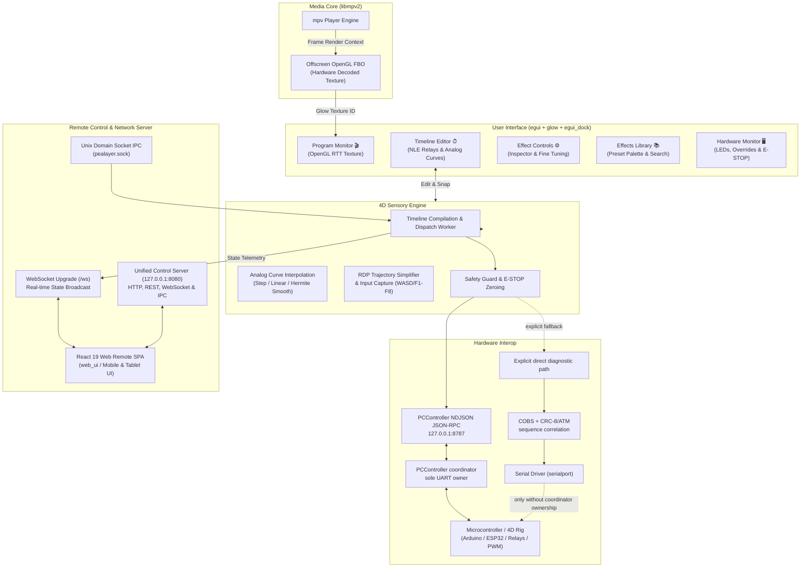

<div align="center">


# Pealayer

### **High-Performance, Hardware-Accelerated 4D Cinema Player & Haptic Timeline Workstation**

[](https://github.com/ToghrolTP/pealayer/actions/workflows/ci-cd.yml)
[](https://github.com/ToghrolTP/pealayer/actions/workflows/codeql.yml)
[](https://github.com/ToghrolTP/pealayer/releases/latest)
[](https://www.rust-lang.org/)
[](LICENSE)
[](https://github.com/emilk/egui)
[](https://mpv.io/)
[](web_ui)
[](https://github.com/ToghrolTP/pealayer)

<br/>


[Key Features](#key-features) • [System Architecture](#system-architecture) • [Feature Walkthrough](#feature-walkthrough) • [Hardware Protocols](#hardware-serial-protocol) • [Web Remote Control](#web-remote-control--restwebsocket-apis) • [Installation & Building](#installation--prerequisites) • [Shortcuts](#shortcut-keybindings)

</div>

---

## Overview

**Pealayer** is an open-source, cinema-grade 4D media player and non-linear physical effect authoring workstation built in **Rust**. It brings together **egui** (via `eframe` & `glow`) and **mpv** (via `libmpv2`) to deliver an ultra-responsive, hardware-accelerated video rendering pipeline embedded directly into a modern, Premiere Pro / DaVinci Resolve inspired multi-tab docking workspace.

With Pealayer, you can author, edit, and orchestrate real-time physical sensory cues—such as **water mist nozzles**, **wind turbines**, **subwoofer seat shakers**, **fog generators**, **strobes**, and **analog PWM actuators**—perfectly synchronized with any video timeline down to the millisecond.

Whether designing an immersive theme park ride, an experiential 4D theater, or home theater haptics, Pealayer provides professional authoring ergonomics, fail-safe hardware guards, and remote web control in a single lightweight binary.

---

## Key Features

### PCController-owned effects

Pealayer discovers one live effect library from PCController. Recorded seat or
multi-peripheral sequences and host-rendered addressable-light streams use the
same stable references and the same play/stop engine. Pealayer deliberately
does not seed or persist an independent effect catalog.
It does persist the latest media's cue placements as stable controller
references, so authored timing survives restart and remains editable offline
without duplicating PCController's effect steps.

1. Connect Pealayer to a PCController endpoint and open **Effects Library**.
2. Drag a live card onto the **Controller effects** timeline track. The card
   stays under the pointer at the exact grab offset and drops at the selected
   time.
3. Right-click a card for **Manage** or **Run now**. **Manage** opens the
   resizable effect editor: its capability-derived lanes show every cue on a
   timing ruler. Drag a cue to move it; drag either edge to resize it; use
   snapping, quantization, keyboard nudging, duplicate/delete, or **Remove
   delay** to refine the sequence. The selected cue exposes the right control
   for its channel type, including seat/relay duration, PWM or RGB fade target,
   easing, curve quality, and repetition.
4. Live capture is available in that same editor. Start recording, operate any
   advertised controls, inspect status, then choose **Finish and edit**. The
   saved PCController take opens on the editor timeline and is also placed at
   the playhead where recording started.
5. Timeline playback calls `effect play effect:<stable-id>`; lighting cues
   receive a matching `effect stop` at their authored end. The stored
   definition remains solely in PCController.

The PCController Web UI, TUI, CLI/IPC, and other Pealayer instances see edits
from the same catalog on their next authoritative snapshot.

See [Effects recording and authoring](docs/EFFECTS-RECORDING.md) for the
end-user workflow, terminology, offline behavior, Relay 8 example, and
hardware-free verification.

### 🎬 Cinema-Grade Video Core & OpenGL RTT
* **Hardware-Accelerated Render-To-Texture (RTT)**: Decodes video frames via NVDEC, VA-API, or D3D11VA and renders directly into an offscreen OpenGL framebuffer texture inside egui's rendering context.
* **Aspect-Ratio-Locked Viewport**: Automatically maintains pixel-perfect 16:9 letterboxing/pillarboxing with high-DPI scaling and zero frame stretching.
* **Audio & Subtitle Track Switching**: On-the-fly stream selection with fine-grained ±600s delay compensation and subtitle font sizing.

### ⏱ Premiere-Inspired NLE Timeline Editor
* **Multi-Track Sequence Workspace**: Dedicated tracks for Video, Audio, relay outputs, and Analog PWM automation curves.
* **Magnetic Snapping**: 5-pixel threshold snapping to the playhead, neighboring clip edges, and keyframe points.
* **Interactive Edge Trimming & Scaling**: Drag clip edges left or right to trim duration with proportional time-scale pattern stretching.
* **Template Isolation (Copy-on-Write)**: Modifying a placed cue automatically clones the template, protecting shared library presets from unintended edits.
* **Deep Multi-Level Undo/Redo**: Full history tracking across all moves, trims, deletions, and track relocations (`Ctrl+Z` / `Ctrl+Y`).
* **Lasso Marquee Selection**: Click-and-drag rubber-band selection across multiple cues and keyframes simultaneously.
* **Capability-Driven Track Routing**: Accepts and relocates cues only against the exact output IDs and names advertised by the connected PCController. No actuator roles or fallback relay mappings are invented locally.

### 📈 Continuous Analog Curve Automation
* **High-Precision Actuator Curves**: Smooth intensity automation for variable-speed fans, proportional valves, vibration rumblers, and lighting.
* **Three Interpolation Algorithms**:
  * **Step**: Holds value until the next keyframe.
  * **Linear**: Constant linear ramp between points.
  * **Smooth**: Cubic Hermite smoothstep for natural, organic transitions.
* **Live Motion Capture Recording**: Arm analog tracks and capture motion curves in real-time during playback using keyboard arrows, WASD, or UI throttle sliders, featuring automatic **Ramer-Douglas-Peucker (RDP)** point simplification and punch-in overwriting.

### ⚡ Industrial Hardware Protocol Support
* **Coordinator-First Control**: Normal output uses persistent NDJSON JSON-RPC 2.0 to PCController at `127.0.0.1:8787`; PCController remains the sole UART owner, safety authority, and board coordinator.
* **Native Board Wire Contract**: The explicit diagnostic/fallback path follows PCController's living COBS/TLV feature contract; PCController remains the protocol authority.
* **Ownership Arbitration**: Direct serial is rejected while PCController is reachable unless `PEALAYER_ALLOW_DIRECT_SERIAL=1` is deliberately set for diagnostics.
* **Capability-Bound Digital Recording Shortcuts**: During playback, the available F-key positions bind in catalog order to at most the first eight outputs actually advertised by PCController. Missing outputs have no shortcut and recorded cues retain the advertised output ID and name.
* **Controller-Owned Strip Effects**: LED-strip streams and named effects are consumed only when advertised through PCController's living capability/RPC surface. Pealayer does not carry a duplicate effect-name list or board renderer; implementation and physical proof are tracked in [PCController #390](https://github.com/atomicdeploy/PCController/issues/390).

### 🛡 Hardware Monitor & Mission-Critical Safety
* **Emergency Stop (E-STOP)**: Global hardware software latch locking all relays and PWM lines low instantaneously.
* **Automatic Failsafe Zeroing**: Automatically dispatches coordinated relay/PWM all-off commands on pause, seek, stop, track muting, or hardware disconnection to prevent solenoids, heaters, or valves from burning out or flooding.
* **Live Actuator Telemetry**: Real-time status LEDs and manual "Force ON" overrides in the Hardware Monitor panel.

### 🌐 Built-In Web Remote Control & REST/WebSocket APIs
* **Unified Control Contract**: HTTP, REST, WebSocket, JSON-RPC, CLI, and single-instance IPC dispatch the same typed player commands. Network automation uses the loopback-only listener at `127.0.0.1:8080`; local process launches prefer OS-native IPC and fall back to HTTP. Set `PEALAYER_PORT` to override the port, or `PEALAYER_WEB_BIND` to a specific interface address only when remote access is intended.
* **Mobile-Responsive Remote Web App**: Standalone SPA built with **React 19**, **TypeScript**, **Vite**, and **Ant Design 6** (`web_ui/dist`). Control playback, seek, adjust volume, and trigger E-STOP from any phone, tablet, or secondary monitor.
* **Remote Media Library & Thumbnail Caching**: Browse server directories, inspect media durations, and view dynamically cached video thumbnails over HTTP.

### 🖥 Operating System Integration & IPC
* **Unix Domain Socket IPC**: Direct headless automation on Linux via `/tmp/pealayer.sock` or `$XDG_RUNTIME_DIR/pealayer.sock`.
* **Windows Named-Pipe IPC**: Second-process launches and local commands use a per-application, per-session named pipe before trying the loopback HTTP fallback. Single-instance mode is enabled by default and can be changed in **Preferences → Advanced → Application instance**.
* **Pealayer Automation Endpoint**: Pealayer's newline-compatible command transport is available at `POST http://127.0.0.1:8080/api/ipc`, while JSON-RPC 2.0 remains at `/api/rpc`. These are distinct from the PCController coordinator endpoint on `:8787`; `:8787` remains the controller fallback.
* **Desktop File Associations**: 1-click registration as default system player for 9+ media formats (`.mp4`, `.mkv`, `.avi`, `.webm`, `.mov`, `.flv`, `.mp3`, `.flac`, `.wav`) via Windows Registry (`winreg`) and Linux FreeDesktop XDG desktop entries (`xdg-mime`).
* **Automatic Sidecar Mounting**: Automatically discovers and loads `<video>.4d.json` timeline projects saved alongside movie files.
* **Native Multi-File Drop**: Dropped media is opened or queued, external subtitles are attached, and timeline JSON is imported according to the actual file type.
* **System-Aware Desktop UI**: Uses the host UI font and light/dark preference, keeps the Windows caption synchronized, and updates the window title from the active media and hardware state. `APP_NAME`, `APP_ICON` (PNG path), `APP_THEME=system|light|dark`, `APP_LOCALE=system|en|fa`, and `APP_DIRECTION=auto|ltr|rtl` override deployment branding and appearance without recompilation. These locale, direction, and theme values intentionally match PCController WebUI's appearance contract. Persian uses a bundled Vazirmatn fallback and right-to-left application chrome; live PCController board, relay, effect, and macro names remain exactly as advertised instead of being replaced with translated samples.
* **Portable Mode**: Automatic detection of `portable.flag` or local `pealayer.json` for self-contained, configuration-free deployments on USB drives.
* **Reproducible visual QA**: Windows and Linux screenshot update commands, artifact hashes, and stale-image checks are documented in [`docs/SCREENSHOTS.md`](docs/SCREENSHOTS.md).
* **Documentation**: Operator, integration, packaging, localization, and troubleshooting guidance lives in the [Pealayer Wiki](https://github.com/ToghrolTP/pealayer/wiki).

---

## System Architecture



---

## Feature Walkthrough

### 1. Timeline Editing & Magnetic Ergonomics
Drag effects from the **Effects Library** directly onto matching relay and PWM tracks. Move, resize, and scrub with playhead snapping, multi-selection, and automatic template isolation.


### 2. Live Motion Capture & Hardware Overrides
Observe live relay LEDs in the **Hardware Monitor**. Toggle manual overrides, trip the Emergency Stop (**E-STOP**), or hold `F1`–`F8` or keyboard throttle to capture physical effects in real-time during playback.


---

## Hardware Coordination and Serial Protocol

Pealayer normally communicates with PCController over persistent loopback NDJSON JSON-RPC. PCController owns the serial port, converts semantic relay/PWM commands to its native COBS/CRC protocol, correlates board replies, and routes board-originated navigation back to registered applications. This prevents two desktop processes from opening the same UART or applying conflicting safety policies.

When a packaged `pccontroller.dll`, `pccontroller.so`, or `pccontroller.dylib` is available beside Pealayer (or through `PEALAYER_PCCONTROLLER_LIBRARY`), Pealayer prefers the real in-process PCController Host. It keeps the Go shared runtime loaded for the process lifetime and executes the canonical `host_create` → `host_start` → `host_call` / `host_endpoints` lifecycle, followed by `host_stop` → `host_destroy` at shutdown. `PEALAYER_PCCONTROLLER_DATA_ROOT` overrides its private Host data directory, and `PEALAYER_PCCONTROLLER_HTTP_ADDRESS` optionally enables an HTTP/WebSocket listener. If the library is absent or another coordinator owns the Host identity/listener, Pealayer falls back to the external coordinator at the selected local endpoint; it never turns that failure into an implicit direct-UART open. The status bar reports the transport that actually connected.

### 1. PCController Coordinator API (Recommended)

```text
Pealayer timeline -> JSON-RPC 2.0 -> PCController -> COBS/CRC-8/ATM -> board
board keys/menu   -> COBS/CRC-8/ATM -> PCController -> Pealayer JSON-RPC/API
```

The default endpoint is `pccontroller://127.0.0.1:8787`. Relay commands use PCController's shared command dispatcher; PWM uses typed `controller.pwm.set`/`controller.pwm.off` methods. Pealayer's live integration test calls `controller.status`, which crosses JSON-RPC, PCController's native board request, COBS decoding, and the correlated response path.

Hardware discovery and connection are enabled by default and can be disabled in **Preferences → PCController and hardware**. At startup Pealayer probes the configured coordinator and the canonical local endpoint, prefers a healthy coordinator whose advertised board profile is both attached and configured, and otherwise selects `pccontroller://127.0.0.1:8787` so the bundled-host/external-host retry path remains available. It does not infer a seat profile from relay order.

PCController's peripheral catalog is authoritative for stable control/action keys and mutable names, icons, and groups. Pealayer renders semantic controls only from advertised action IDs, invokes them through `controller.action.invoke`, and edits channel names through the presentation contract. Older coordinators remain rename-compatible through `controller.peripherals.set`. Renames made in PCController WebUI/TUI are refreshed into Pealayer after the `peripherals.changed` notification (with periodic catalog refresh as recovery), while saved projects continue to identify hardware by stable keys rather than labels.

#### Hardware effect authoring

With an attached, configured board, open **Effects Library → Manage** and use
**Record live controls**. Enter a take name and start at the desired video
playhead. PCController records acknowledged board-applied actions coming from
Pealayer, its TUI/Web/API, RF, or the physical front panel. **Status** reports
the take; **Finish and edit** persists it in PCController, refreshes the
authoritative catalog, inserts its durable cue at the original video anchor,
and opens the captured sequence for timeline refinement. **Discard take**
keeps neither the recording nor a timeline cue.

Addressable-strip effects are never synthesized by Pealayer. Only stable effect IDs advertised by the connected PCController are shown. Use **Preview**/**Stop preview** in Hardware Monitor for the live board, or drag an advertised strip effect from **Effects Library** onto **Controller effects**. The cue duration controls when Pealayer sends the matching start and stop commands during video playback; pause and seek stop an active preview so lighting cannot drift from the playhead.

Pealayer also registers a leased `pealayer` application instance over PCController's `/ipc` WebSocket, subscribes to pushed state/event/opcode streams, and advertises exact-target player actions. PCController or a board mapping can send `pealayer.play`, `pealayer.pause`, `pealayer.toggle`, `pealayer.seek`, `pealayer.seek_absolute`, `pealayer.volume.set`, `pealayer.open`, or the compatible `app.page` navigation aliases. Pealayer deduplicates each operation/delivery pair, rejects malformed, expired, or unsupported deliveries, applies valid commands on the player thread, and acknowledges the coordinator's delivery nonce.

### 2. Direct PCController Wire Contract (Diagnostic/Fallback Only)
When the coordinator is unavailable, selecting a `direct:` endpoint uses:

```text
[ 0xA5 (Magic) | 0x01 (Rev) | Opcode (u8) | Sequence (u8) | Length (u8) | Payload (NB) | CRC-8/ATM ]
```

* **Opcode `0x11`**: Set 12-bit PWM channel (`value: 0..=4095`, little-endian).
* **Opcode `0x31`**: Set digital relay state (`id`, `state`).
* **Opcode `0x33`**: Emergency All-Off command.

> [!IMPORTANT]
> Direct serial is a diagnostic escape hatch, not a second production driver. Pealayer refuses it when PCController is reachable unless `PEALAYER_ALLOW_DIRECT_SERIAL=1` is explicitly present.
> Each direct request waits for the correlated native `ACK`, `HELLO_RESP`, or `ERROR` frame; an absent or mismatched response fails closed instead of being reported as a successful write.
> **Automatic Fail-Safe Zeroing**: On playback pause, seek, stop, track muting, or serial cable disconnection, Pealayer requests coordinated relay/PWM shutdown (or sends the native COBS `AllOff` frame on the explicit direct path) to prevent physical solenoids, heaters, or pneumatic valves from sticking energized.

---

## Web Remote Control & REST/WebSocket APIs

Pealayer embeds a high-performance web service to control playback and view media libraries over local networks.

The Web interface is also an installable mobile/desktop PWA and a real
client-side SPA. Its generated service worker precaches the exact hashed build,
keeps the application shell available offline, and restores the last known
runtime/configuration/player snapshot as read-only context until the Rust
backend reconnects. Live hardware/player commands are never queued from stale
offline state. Supported browsers additionally expose contextual install,
share, fullscreen, notification, haptic/audio-feedback, Media Session, app
badge, and playback wake-lock integrations. Permission-requiring features are
requested only from an explicit user action.

All TCP-facing interfaces share one listener. `PEALAYER_PORT` selects that
listener (default `8080`). There are no protocol-specific port settings. Unix
builds may additionally expose their native domain socket, which does not
consume a TCP port.

To run Pealayer with the full Rust/libmpv/PCController backend but no visible
native egui window, start it in Web-only mode:

```text
pealayer --web-only
# Alias:
pealayer --headless
```

Then open `http://127.0.0.1:8080/`. Set `PEALAYER_WEB_BIND` and
`PEALAYER_PORT` before launch when a deliberately remote-accessible listener is
required. Web-only mode preserves the same typed commands, WebSocket state,
media engine, effect/macro engine, and hardware integration as the desktop UI;
it only hides the native viewport. Browser APIs such as install, wake lock,
notifications, and vibration remain capability/secure-context dependent.

<div align="center">
  <b>Local Web Remote:</b> <code>http://127.0.0.1:8080/</code> &nbsp;•&nbsp; <b>WebSocket Endpoint:</b> <code>ws://127.0.0.1:8080/ws</code><br>
  For an intentionally shared LAN remote, set <code>PEALAYER_WEB_BIND</code> to the machine's interface address and use that address from the client.
</div>

### REST Endpoints

| Method | Endpoint | Description |
| :--- | :--- | :--- |
| `GET` | `/api/player/status` | Returns playback state, including `duration`, `seekable`, `live`, `buffered_until`, and `buffering_percent` |
| `GET` | `/api/player/commands` | Discovers the shared typed command contract and supported transports |
| `POST` | `/api/player/command` | Dispatches player commands (JSON payload), including local files and remote media URLs |
| `POST` | `/api/rpc` | JSON-RPC 2.0 methods such as `pealayer.play`, `pealayer.seek`, `pealayer.open`, and `pealayer.status` |
| `POST` | `/api/ipc` | CLI and single-instance command transport; accepts legacy command JSON or newline-compatible JSON-RPC payloads |
| `GET` | `/healthz` | Service/API liveness for coordinators and supervisors |
| `GET` | `/api/fs/browse?dir=<path>` | Lists directory entries, folders, video files, and metadata |
| `GET` | `/api/fs/thumbnail?path=<path>` | Returns extracted, cached thumbnail image (JPEG/PNG) for media files |

### WebSocket Protocol (`ws://127.0.0.1:8080/ws`)
Send and receive JSON command packets in real time:

```json
// Toggle playback
{ "command": "toggle_pause" }

// Seek relative
{ "command": "seek", "seconds": 15.0 }

// Seek absolute percentage (0.0 to 100.0)
{ "command": "seek_abs", "percentage": 50.0 }

// Adjust volume (0.0 to 100.0)
{ "command": "set_volume", "value": 75.0 }

// Open media file
{ "command": "open", "target": "/path/to/movie.mp4" }

// Open an HTTP file, HLS manifest, or live feed (RTSP/RTMP/SRT/UDP/TCP)
{ "command": "open", "target": "rtsp://camera.example.invalid/live" }
```

The same operations are available from the executable. Examples:

```text
pealayer movie.mkv --fullscreen --play
pealayer --seek-to 90 --rate 1.25 --unmute
pealayer --workspace nle --maximize
pealayer --remote "seek -10"
pealayer --command "{\"command\":\"set_volume\",\"value\":65}"
```

When single-instance mode is enabled, these switches are delivered in order to
the active window rather than creating a second player. Run `pealayer --help`
for the full switch list.

Remote targets also appear in **Open Recent** and reopen through their original
network protocol. Seek controls are enabled only when mpv reports the source as
seekable; buffered remote files show their cached range on the seek bar, while
non-seekable streams are labelled **LIVE**. URL credentials are redacted from
visible metadata and API status, and network URLs are excluded from Windows'
shell recent-document history. Treat saved application configuration as private
because replayable recent targets remain local to Pealayer.

---

## Hardware Simulation & Virtual Testing

Don't have physical Arduino hardware on hand? Pealayer includes a virtual serial loopback harness using `socat`.

```bash
# 1. Start a virtual PTY loopback pair
./scripts/sim_bridge.sh

# 2. Output will indicate two virtual serial endpoints, e.g.:
#    socat[1234] N PTY is /dev/pts/2
#    socat[1234] N PTY is /dev/pts/3

# 3. In Pealayer's Hardware Monitor tab, connect to: /dev/pts/2
# 4. Attach your mock hardware responder or virtual board script to: /dev/pts/3
```

To bridge virtual PTYs directly to a TCP socket:
```bash
./scripts/sim_bridge.sh --tcp 8765
```

---

## Shortcut Keybindings

| Keybinding | Action |
| :--- | :--- |
| `Space` | Toggle Play / Pause |
| `F` | Toggle Fullscreen Mode |
| `M` | Mute / Unmute Video Audio |
| `Arrow Left` / `Arrow Right` | Seek backward / forward 5 seconds |
| `Shift` + `Arrow Left` / `Right` | Seek backward / forward 1 second (fine scrub) |
| `Arrow Up` / `Arrow Down` | Increase / decrease master volume |
| `Ctrl` + `Z` | Undo last timeline edit / move / trim |
| `Ctrl` + `Y` / `Ctrl` + `Shift` + `Z` | Redo last reverted edit |
| `Delete` / `Backspace` | Delete selected timeline instances or keyframes |
| Available `F1` to `F8` positions | Hold during playback to record the correspondingly ordered PCController-advertised output; unavailable positions do nothing |
| `W` / `S` or `Up` / `Down` | Ramp analog throttle up / down during curve recording |

---

## Installation & Prerequisites

### 1. Host Dependencies

#### Linux (Debian / Ubuntu / Linux Mint)
```bash
sudo apt update
sudo apt install -y libmpv-dev pkg-config libasound2-dev libx11-dev libxcb-shape0-dev libxcb-xfixes0-dev libudev-dev
```

#### Linux (Arch Linux / Manjaro)
```bash
sudo pacman -S --needed mpv pkgconf alsa-lib libx11 libxcb systemd
```

#### Linux (Fedora / RHEL)
```bash
sudo dnf install -y mpv-libs-devel pkgconfig alsa-lib-devel libX11-devel libxcb-devel systemd-devel
```

#### macOS
```bash
brew install mpv pkg-config
```

---

### 2. Windows Setup (Native & Cross-Compilation)

Because Pealayer links against `libmpv`, you must supply a matching import library (`libmpv.dll.a` for the GNU toolchain or `mpv.lib` for MSVC) and `libmpv-2.dll`:

1. Download the 64-bit `mpv-dev` package (from [shinchiro/mpv-winbuild-cmake releases](https://sourceforge.net/projects/mpv-player-windows/files/libmpv/) or [zhongfly/mpv-winbuild releases](https://github.com/zhongfly/mpv-winbuild/releases)).
2. **Native Build**:
   ```powershell
   # Point cargo linker to the extracted mpv-dev folder
   $env:RUSTFLAGS="-L native=C:\path\to\mpv-dev"

   # Compile and launch
   cargo run --release
   ```
3. Place `libmpv-2.dll` directly next to `pealayer.exe` (or add it to your system `%PATH%`).

For a machine-wide installation at `%ProgramFiles%\MPV`, set `LIBMPV_DIR` to that directory (or rely on the script's default) and use the checked-in launcher:

```powershell
# Build the locked release profile, copy libmpv beside the executable, and start Pealayer.
.\scripts\run-windows.ps1

# Build without starting the GUI.
.\scripts\run-windows.ps1 -BuildOnly

# Use the debug profile when iterating locally.
.\scripts\run-windows.ps1 -DebugBuild
```

For the canonical tested Windows package, run `build.cmd`. The one Windows checkout lives at `%LOCALAPPDATA%\Programs\Pealayer\source\Pealayer` and the script mirrors PCController's stable layout by publishing the real files `%LOCALAPPDATA%\Programs\Pealayer\bin\pealayer.exe`, `libmpv-2.dll`, and `host-manifest.json` (no hashed package directory and no `bin` junction). Outside that canonical layout it falls back to a repository-local `bin` for contributor builds. Tests and Win32 resources are verified before UPX 5.2 packages the executable with `--best --lzma`; `upx -t` and a packed libmpv smoke test must then pass. Use `build.cmd -NoUpx` only when an unpacked diagnostic binary is intentionally required, or `build.cmd -SkipTests` for a measured incremental package rebuild.

The lower-level launcher accepts additional application arguments after its switches and keeps Cargo output under this repository's `target` directory. It uses `CARGO_ENCODED_RUSTFLAGS` so installation paths containing spaces are passed to `rustc` correctly.

Current mpv builds require a Vulkan loader that exports Vulkan 1.1 entry points. If `mpv.com --version` exits with Windows status `0xc0000139`, update the graphics driver or install the current [LunarG Vulkan Runtime](https://vulkan.lunarg.com/sdk/home) and retry before debugging Pealayer itself.

#### Cross-Compiling for Windows from Linux
You can cross-compile a Windows PE binary from Linux and test it using Wine:
```bash
# 1. Install MinGW cross-compiler
sudo apt install -y gcc-mingw-w64   # Ubuntu/Debian
sudo pacman -S mingw-w64-gcc       # Arch Linux

# 2. Add Windows compilation target
rustup target add x86_64-pc-windows-gnu

# 3. Compile release executable
RUSTFLAGS="-L native=target/mpv-win64" cargo build --release --target x86_64-pc-windows-gnu

# 4. Run via Wine
cp target/mpv-win64/libmpv-2.dll target/x86_64-pc-windows-gnu/release/
wine target/x86_64-pc-windows-gnu/release/pealayer.exe
```

---

### 3. Web UI Assets (Optional for Development)
Pealayer includes pre-built assets in `web_ui/dist`. If you modify the React remote control app:
```bash
cd web_ui
npm ci
npm run build
cd ..
```

`npm run build` is a production gate rather than a plain Vite invocation: it
type-checks, bundles, injects the content-derived service-worker precache
manifest, writes `dist/pwa-build.json`, and verifies that every hashed bundle
referenced by `index.html` is offline-cached. CI and Windows packaging call the
same command, so a stale or incomplete PWA cannot silently enter a packaged
Pealayer build. `npm run verify:pwa` reruns the final artifact audit.

---

## Quick Start

1. **Clone the repository**:
   ```bash
   git clone https://github.com/ToghrolTP/pealayer.git
   cd pealayer
   ```

2. **Run Pealayer**:
   ```bash
   cargo run --release
   ```

3. **Run the Automated Test Suite**:
   ```bash
   cargo test --locked
   ```

---

## Project Structure

```text
pealayer/
├── Cargo.toml                  # Rust package manifest (2024 edition)
├── build.rs                    # Windows resource compiler (embeds app icon)
├── assets/                     # Canonical application icons (PNG, SVG, and multi-res Windows ICO)
│   ├── pealayer-icon.png
│   ├── pealayer-icon.svg
│   └── icon.ico
├── src/
│   ├── main.rs                 # eframe application entry point & OpenGL initialization
│   ├── app.rs                  # Main PealayerApp state, docking layout & transport
│   ├── config.rs               # Persistent config loader & XDG/AppData/portable paths
│   ├── four_d/                 # 4D sensory engine subsystem
│   │   ├── models.rs           # Timeline, Effect, AtomicAction, and HardwareTarget models
│   │   ├── curve.rs            # Analog tracks, keyframe math & Hermite cubic smoothstep
│   │   ├── curve_record.rs     # Punch-in recording & Ramer-Douglas-Peucker simplification
│   │   ├── input_capture.rs    # Keyboard/WASD throttle input capture with rate ramp
│   │   ├── engine.rs           # Background thread playback evaluator & serial dispatcher
│   │   ├── protocol.rs         # COBS encoding, CRC-8, and PCController wire contracts
│   │   ├── history.rs          # Multi-level undo/redo snapshot stack
│   │   └── patterns.rs         # Procedural pulse and blink cue generators
│   ├── mpv/                    # libmpv2 integration
│   │   ├── mod.rs              # Player wrapper, properties, events & track management
│   │   └── render.rs           # Offscreen OpenGL RTT context & framebuffer texture bridge
│   ├── platform/               # Operating system interop
│   │   ├── association.rs      # System default player & MIME type registration
│   │   ├── windows.rs          # Windows Registry (HKCU) ProgID bindings
│   │   └── interop.rs          # Unix domain socket server (pealayer.sock)
│   ├── server/                 # Embedded network server
│   │   ├── mod.rs              # Unified HTTP, WebSocket & IPC control server
│   │   ├── fs_api.rs           # REST directory navigation & media file explorer
│   │   ├── thumbnails.rs       # Video thumbnail extractor & filesystem cache
│   │   └── web_assets.rs       # Embedded / static SPA asset router
│   └── ui/                     # egui user interface panels
│       ├── layout.rs           # egui_dock TabViewer implementation & docking panes
│       ├── video.rs            # Aspect-locked OpenGL video canvas rendering
│       ├── controls.rs         # Transport buttons, seekbar, volume slider & timecode
│       ├── four_d.rs           # Multi-track timeline canvas, clips & keyframe editor
│       ├── menu.rs             # Top menu bar (File, Tracks, Subtitles, Audio, Help)
│       ├── subtitles.rs        # Subtitle track selector & delay controls
│       ├── audio.rs            # Audio stream selector & sync controls
│       └── status_bar.rs       # Bottom status bar with telemetry & port state
├── tests/                      # Integration and regression test suite (90+ tests)
├── web_ui/                     # React 19 + TypeScript + Vite remote control web app
├── scripts/                    # Virtual serial loopback simulation harness (sim_bridge.sh)
└── docs/                       # Technical specs, architecture plans & preview assets
```

---

## Continuous Integration & Automated Releases

Pealayer includes a multi-platform [GitHub Actions CI/CD Pipeline](.github/workflows/ci-cd.yml):
* **Automated Matrix Testing**: Runs `cargo test --locked` on both Ubuntu Linux and Windows environments for every pull request and push.
* **Dynamic Dependency Resolution**: Windows CI fetches the latest official x86_64 `libmpv` releases, builds with MinGW, and automatically pairs the runtime DLL.
* **Standalone Release Packaging**: Generates ready-to-run `.tar.gz` (Linux) and `.zip` (Windows) bundles containing the executable, documentation, licenses, and pre-compiled Web UI assets.
* **Automated Release Publishing**: Pushing a version tag (e.g. `git tag v0.1.0 && git push --tags`) automatically publishes official GitHub Releases.

---

## Contributing

Contributions, bug reports, and hardware integration profiles are warmly welcomed!
1. Fork the repository.
2. Create a feature branch: `git checkout -b feature/amazing-actuator`.
3. Ensure all tests pass: `cargo test`.
4. Commit your changes: `git commit -m "feat(actuator): add support for XYZ protocol"`.
5. Push to your branch and open a Pull Request.

---

## License

This project is licensed under the **MIT License** - see the [LICENSE](LICENSE) file for details.
