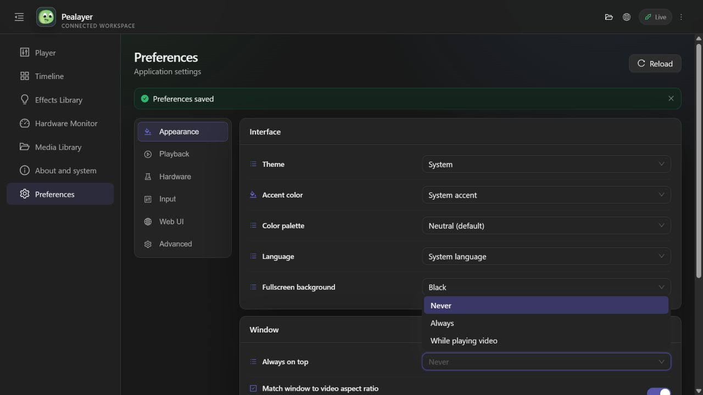

# Always on top

Preferences → Appearance → Window → **Always on top** is a persistent,
live-applied choice shared by desktop Preferences and the Web UI:

- **Never** (default): normal window stacking.
- **Always**: stay above other windows, including while paused or without media.
- **While playing video**: stay above other windows only while a selected video
  stream is playing. Pause and EOF return to normal stacking. Audio-only media,
  album artwork, still images and the headless implementation window do not
  enable this mode.

Desktop Preferences previews changes immediately; Save confirms them and
Discard restores the saved choice. The Web UI saves changes automatically.
The same `always_on_top` config property works through configuration API/RPC,
import and the config file watcher. Values are `never`, `always`, and
`while_playing_video`; invalid enum values are rejected.

The shared settings contract defines the selector once. Runtime reconciliation
uses egui's cross-platform native window-level command, explicitly targeting
the main viewport and only sending on transitions (not each repaint). Actual
stacking availability depends on the platform/window manager.

## Verification — 2026-10-06

Installed Windows build: `8be20071830458bee5c51b0462ec844afd3a3df3`.
Executable SHA-256:
`b0246d829ceba3d95b331f9024cecad6bf138f35bee0c2c7a17f3e8169b77d9f`.
Canonical executable: `%LOCALAPPDATA%\Programs\Pealayer\bin\pealayer.exe`.
Deployed through Pealayer's verified chunked updater and graceful shutdown,
not a direct executable overwrite.

Read-only Win32 `GetWindowLongW(GWL_EXSTYLE)` checked the actual `WS_EX_TOPMOST`
bit on the main player HWND, not merely a requested/configured flag:

| Mode | Playback | Native topmost |
| --- | --- | --- |
| Never | Paused | No |
| Always | Paused | Yes |
| While playing video | Paused | No |
| While playing video | Playing | Yes |
| While playing video | Paused again | No |

Selecting Always in the installed Web UI also set the native topmost bit.
Selecting Never restored normal stacking. Final live and saved config values
are Never; playback was restored to paused at 1256.089 seconds in NLE.
No effect cues were present during the brief playback check.

`cargo check --tests --locked` passed, including compilation of the new shared
selector, enum serialization/default/rejection and complete policy truth-table
checks. Rust tests were not executed, per the requested build workflow.
The locked native release build and Web TypeScript/PWA build/guardrails passed.
Audio-only/EOF branches have compiled policy coverage, but were not separately
exercised with media on the running app. Other operating systems remain a
native acceptance gate.

The native Preferences window opened successfully, but both attempts to
capture it failed with Windows Graphics Capture error `0x8007041D`. There is
no claimed native visual screenshot; the image above is the installed Web UI.

Cafe's `:8080/api/update/manifest` timed out after four seconds, so Cafe
deployment remains blocked on its own updater being reachable. PR #46 stays
draft and unmerged.
