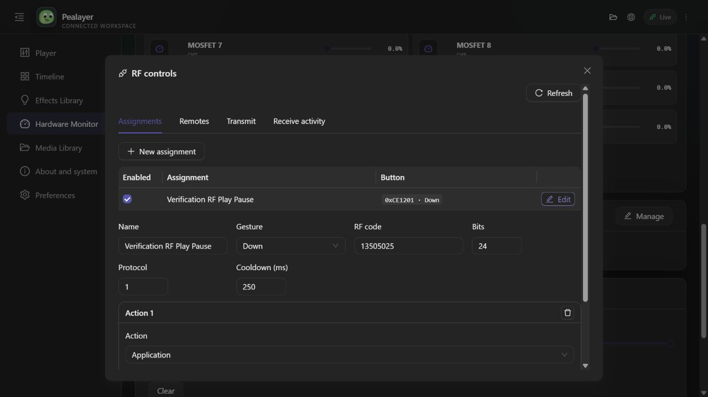
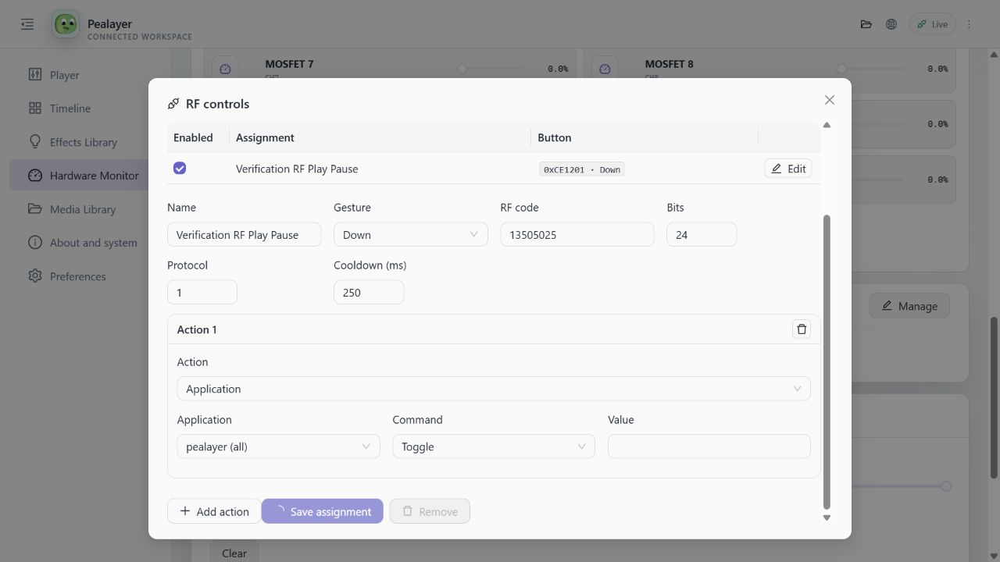
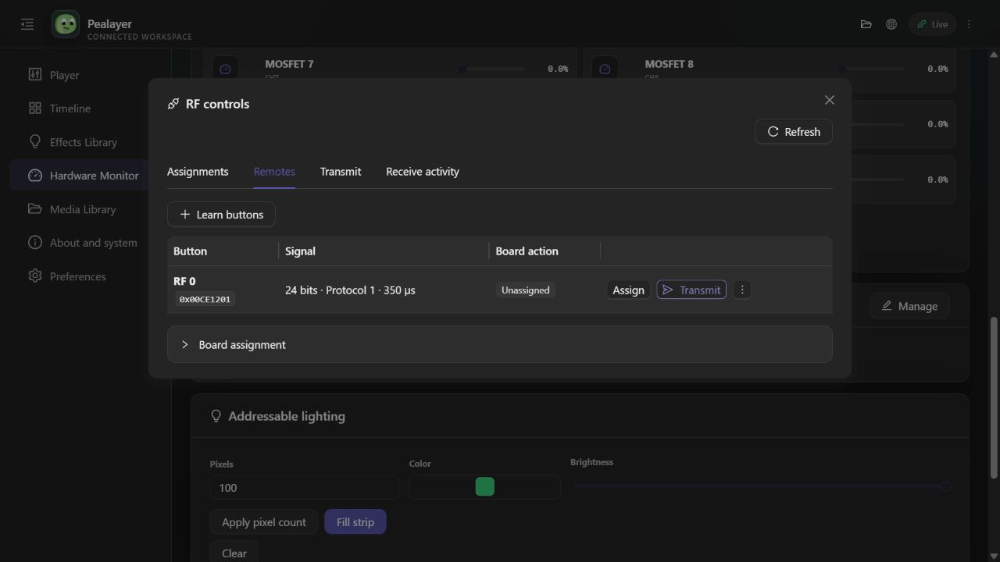
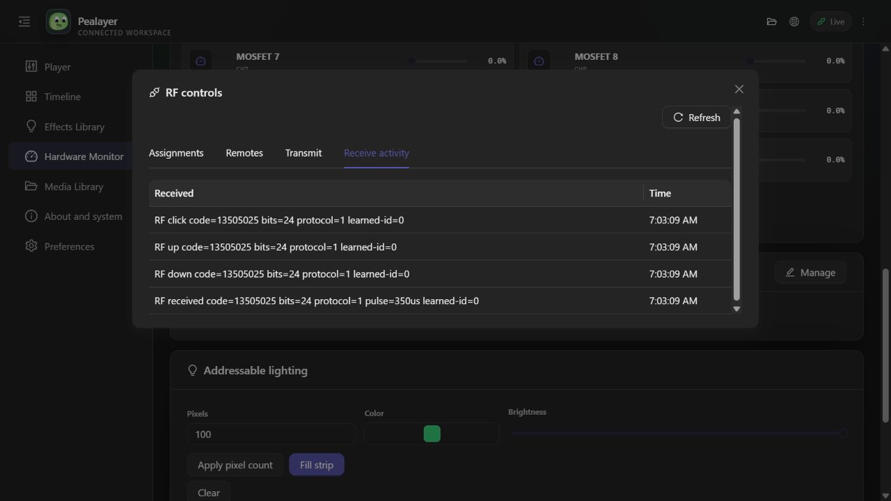

# RF controls

Open **Workspace → RF controls…** (also available in Hardware Monitor and the RF
tool in Effects Library). In the Web Hardware page, use **RF controls → Manage**.

Use **Remotes → Learn buttons** and press a remote button. Pealayer reads the
learned-code catalog when the manager opens and refreshes it from PCController's
RF learning events; **Refresh** remains available for an explicit board read.
Choose **Assign** to bind it. Choose **Application → pealayer (all) → Toggle** for
play/pause. **Down** runs immediately on reception; use **Up** for a separate
release action. Multiple ordered actions can be added to an assignment.

The same manager supports advertised board controls, effects, external programs,
scripts, keyboard keys and full RF waveforms (code, bits, protocol, pulse width,
repeats). Actions and button data come from PCController's API. Assignments are
saved there, not in Pealayer. Change a saved assignment with Edit/Save; disable
it with its checkbox or remove it. The code/bits/protocol/gesture identify the
button, not its list position.

Existing board mappings are shown in Remotes. If replacing one with a Pealayer
action, explicitly Unassign board action; leaving it mapped intentionally runs
both paths. Board actions can also be reassigned with the semantic controls in
the Board assignment section.

Application targets are discovered live. The surface target `pealayer` survives
process restarts and applies to every matching live Pealayer; an instance ID
targets only that one process. `pealayer.command` accepts a compact JSON command
from the same validated IPC/API model, for example `{"command":"play"}` or
`{"command":"seek","seconds":10}`. Individual common commands have simpler
argument values, e.g. `pealayer.seek` with value `10`.

Keyboard and program actions run on the displayed **controller hostname**, not
implicitly on the browser/GUI computer. Native keyboard injection is subject to
the controller's allowlist and explicit consent. The existing key executor
supports single keys and exact modifier chords, e.g. `CTRL+SHIFT+S`; each chord
needs its own consent and modifiers are released on cancellation or error.
External program/script tasks
retain the controller's 30-second timeout; **Launch independently** starts an
application without waiting for it to close. Host mappings need PCController online;
existing EEPROM mappings can work independently.

## Unified control API

All Pealayer command transports accept:

```json
{"command":"rf_control","operation":"catalog","params":{"read_board":true}}
```

JSON-RPC uses `pealayer.rf` with `operation` and `params`. `open_rf_manager` (or
JSON-RPC `pealayer.rf.open`) opens the desktop manager. Mutations are asynchronous;
`status.rf.pending`, `.error`, `.catalog` and `.last_result` in `/api/player/status`
and the normal WebSocket state stream report actual controller results.

Allowed operations are catalog, learn.start/status/cancel, map, remove, clear,
transmit, binding.put/remove. This is not an unrestricted controller RPC proxy.
RF hardware execution still honors the existing E-STOP contract.

Receive/release timing is receiver-derived: Up follows the packet-gap timeout,
not an actual electrical release signal. Learning suppresses host assignments
but does not alter existing firmware-side actions. Real RF over-the-air testing
requires the actual receiver/transmitter; VirtualBoard can validate protocol and
application routing but cannot prove radio range or waveform delivery.

## Verification and installation, 6 October 2026

Installed locally using both products' own verified/graceful update APIs:

| Product | Implementation revision | Executable SHA-256 |
|---|---|---|
| Pealayer | `60dd5bd5f7e3ae9147197afe2a19c57e5e8ca5ce` | `8bfa65699b7fc7eed11c37f52a051ed8b77d43cd1ee1a3223a15300f1d8ecc53` |
| PCController | `3486fc1a` | `f48bfb4e71105a4c3e62fd24db608c4ef75750dce94565294a12c17b143b4191` |

This documentation checkpoint follows the implementation build; it does not
change the running code. The David-PC libmpv runtime was retained, not replaced
with another machine's DLL.

| Check | Observed result |
|---|---|
| VirtualBoard learning/readback | Code, bits, protocol and pulse width returned from the actual board protocol |
| RF receive to playback | Playback toggled; PCController automation event 406 acknowledged completion for receive/gesture event 379 |
| Controller replacement without closing Pealayer | Controller update `op-ff82c9543489a12e` completed; Pealayer PID 17236 remained running; RF receive then toggled playback successfully |
| Web manager | Assignment editing/renaming/reassignment, learning start/stop and learned-waveform transmit exercised through the running app |
| Transmission acknowledgement | `rf-transmit` returned the supplied waveform with `transmitted: true` |
| Windows native/external actions | Ordered external command, native F23 injection, RF transmit and completion marker exercised; original keyboard policy restored afterwards |
| Exact modifier chords | Focused Go tests passed for canonicalization, exact allowlist consent, native key ordering and error/cancellation release cleanup |
| RF activity retention | Focused Go test passed after 1,024 unrelated events; history is independently bounded and excludes bridge echoes |
| Builds | Go host and Web builds passed; Rust `cargo check --tests --locked` passed; Rust tests were not executed |

Restart testing found a neighbor tunnel could temporarily take over the same
local listener. RPC admission and RF operations now compare the persistent
command socket with a fresh selected-endpoint identity. The WebSocket subscription
also follows the authoritative RPC coordinator and uses heartbeat recovery.
Wire/identity failures drop the stale stream; mutations are not automatically
replayed because their outcome may be uncertain.

Temporary RF assignments and the isolated learned verification entry were
removed. The original board connection, paused media position, System theme and
four user effects were restored/preserved.

### Actual screenshots

These show a temporary verification assignment, not preinstalled sample rules.
They are captures of the running Web app, not mockups.






### Remaining acceptance boundaries

Actual radio range/waveform delivery and real-handset reception need physical
receiver/transmitter testing. VirtualBoard cannot prove those. Native desktop
visual/input verification was blocked by the Windows graphics capture service
(`0x8007041D`); no native screenshot proof is claimed. The Cafe update API did not
respond, so no Cafe deployment is claimed. These gates remain open in PCController
issue #73 and the integration PRs; neither draft PR was merged.
