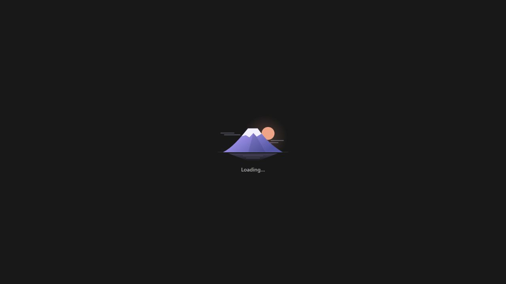
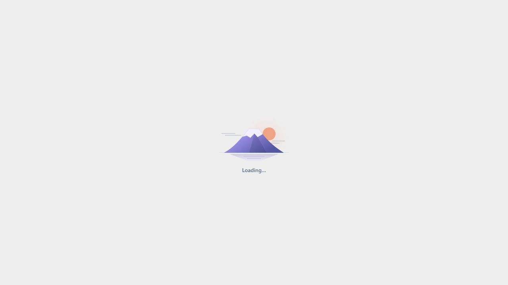
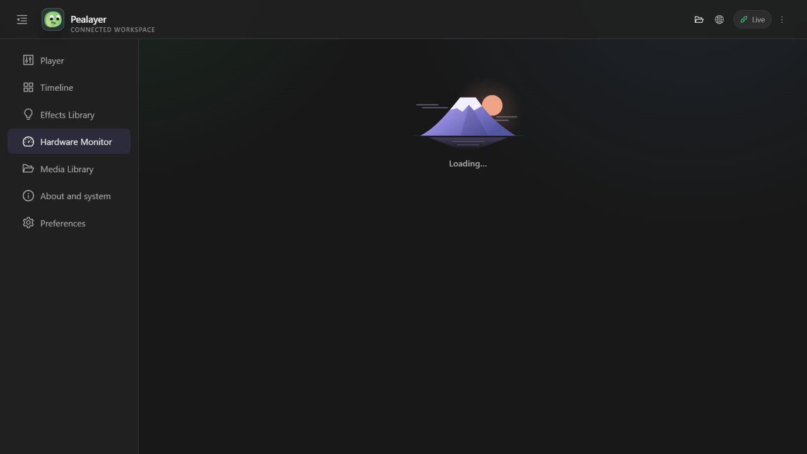

# Readable Web assets and Fuji loading

## Delivered

Generated JavaScript and CSS now use readable filenames: `assets/app.js`,
`assets/app.css`, `assets/HardwareTab.js`, and other named modules. PCController's
current Vite configuration still uses hashed filenames; its semantic entry/chunk
organization informed this change, not an assumption that it already removed hashes.

Removing filename hashes must not allow stale browsers to mix incompatible builds:

- The finalizer fingerprints emitted content, the service-worker template, and its
  own processing recipe. Every generated asset reference has the same `?v=...`
  revision, including template-literal lazy imports and preload references.
- The Rust server sends `Cache-Control: no-cache`. An asset request carrying an
  obsolete revision gets HTTP 409 instead of bytes from another generation.
- The service worker caches exact versioned URLs in the current precache only.
  Unversioned public assets use network-first revalidation with current-cache
  offline fallback. Live API requests and hardware commands remain excluded.
- The build verifies readable filenames, complete versioned references, offline
  loader resources, cache isolation, and the loader's stable geometry.

The Fuji loader is original, lightweight SVG artwork shared by the HTML bootstrap,
lazy-view fallback, and initial Preferences loading state. Snow, sunrise, clouds,
and lake reflections have subtle movement. Reduced-motion disables animation.
The label is localized, has an accessible live status, and the image is decorative.
There is no fabricated progress, artificial minimum duration, or forced splash
delay. A failed lazy view provides Reload rather than an endless loading screen.
Existing application control styles were not changed.

## Verified on 2026-10-06

| Check | Result |
| --- | --- |
| Web build and embedded build guards | Passed; reproducible revision `d039b3cafcd11df0`, 41 precached resources |
| Rust compile-only test-target check | Passed; no Rust test execution |
| Local release build | Passed with existing warnings |
| Own updater upload/verification/restart | Completed; graceful close before replacement |
| Installed source revision | `3dae4bb096e30a1129e5d1b5d29d2d96c3edd48f` |
| Installed executable SHA-256 | `e8537e0d14bdd76571fbf5089225a662f154bf2872b73ccc6cf742af7b376157` |
| Current JS/CSS HTTP responses | 200, `Cache-Control: no-cache` |
| Obsolete asset revision | 409 |
| Installed seven navigation pages | All loaded without the failure boundary or horizontal overflow at the tested desktop viewport |
| Genuine pending bootstrap and lazy-view load | Fuji appears; disappears when the held module request completes |
| Light/dark and reduced motion | Inspected with browser media emulation; no user preference changes |
| Bootstrap before app CSS arrives | Preview checked at 1280x720 and 390x844; no document overflow |
| Interrupted lazy module load | Preview checked: failure message and Reload recover the view |
| Playback preservation | Remained paused at 1256.089 seconds, NLE workspace |
| Cafe-PC | Updater endpoint unreachable; not deployed there in this pass |

Screenshots below were captured from the **installed** server at port 8080 with
only the relevant script request temporarily held in browser developer tooling.
They show real pending loading states, not injected markup or a permanent loader.
All request, cache, theme, motion, and viewport overrides were cleared afterward;
the temporary QA tab and preview server were closed.

### Dark startup

### Light startup

### Lazy view inside the application shell

## Preservation and follow-up

No useful feature source was discarded. Old generated hashed assets were replaced
with their readable generated equivalents; earlier revisions remain in Git.
Browser testing exposed unstamped backtick imports and a bootstrap sizing dependency
on the main CSS. Both were corrected, guarded, rebuilt, pushed, and deployed before
this evidence was recorded. PR 46 remains draft and unmerged.
