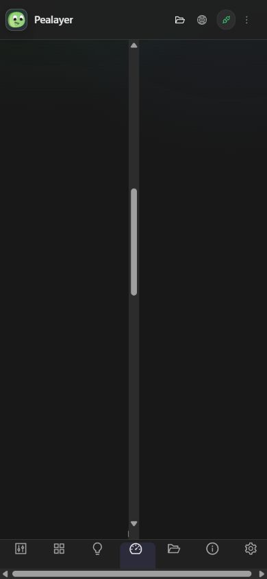
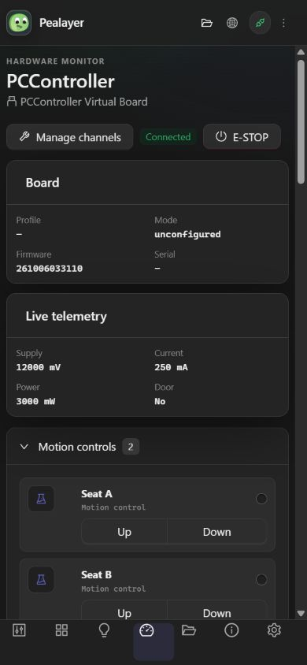
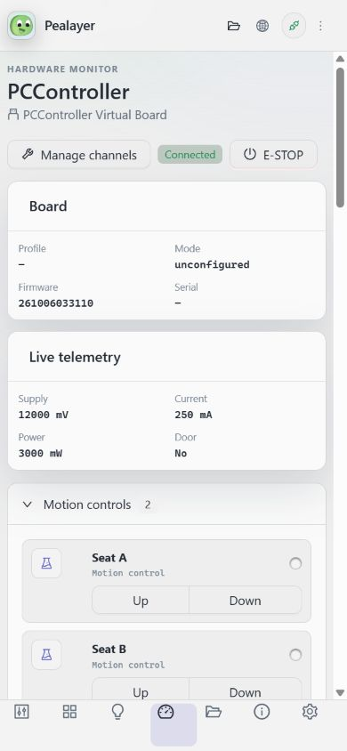
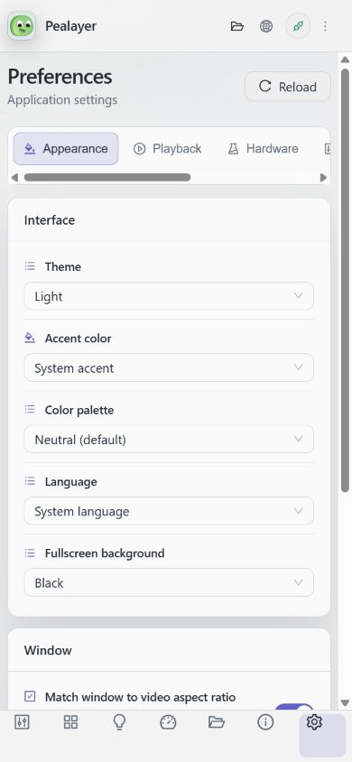
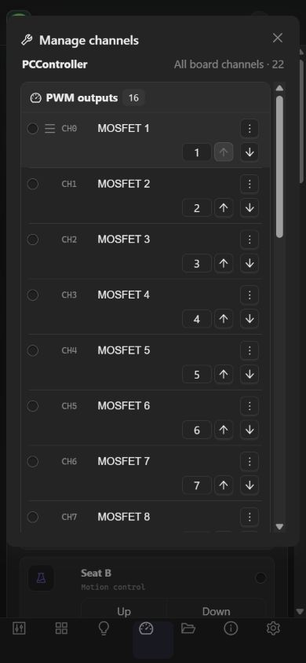
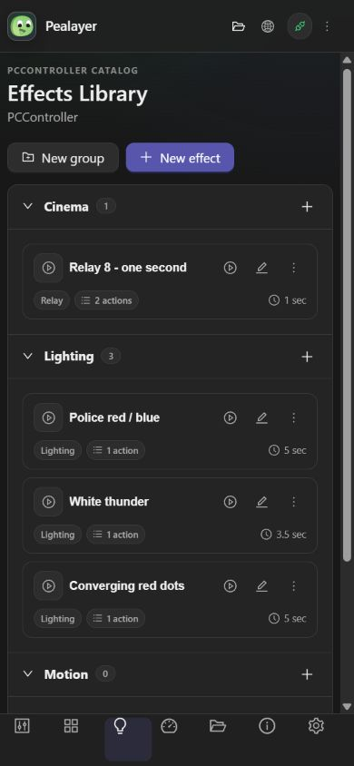
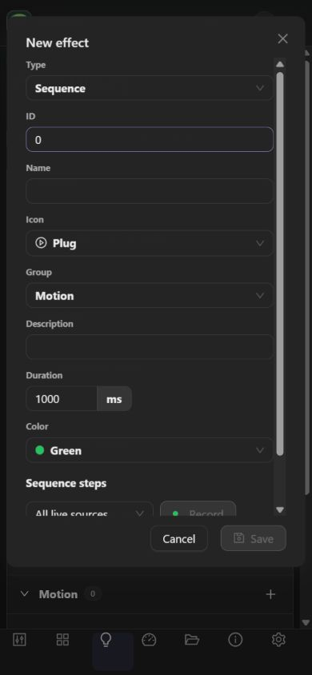
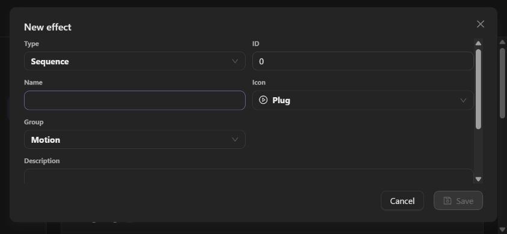

# Responsive Web UI

## Root cause

The phone breakpoint stacked the Ant Design sidebar and content vertically.
Ant Design's `.ant-layout.ant-layout-has-sider > .ant-layout-content` still set
`width: 0`, however. In a column, flex-grow grows height, not width. The content
shrank to its padding: measured at 16 px on a 390 px viewport. Clipping the page
hid almost every control. The old bottom navigation also overflowed its height.

The mobile override explicitly outranks that library selector. Content retains
the available width, independent vertical scrolling, and safe-area padding.
All seven navigation targets fit across the bottom at widths down to 320 px.

## Related fixes

- Grid children and video previews shrink without intrinsic image/title widths
  stretching their columns. Phone previews retain their aspect ratio.
- Compact timeline transport keeps both elapsed and duration visible; its seek
  slider uses a second row instead of competing with the buttons for space.
- Phone timeline order: preview, cues, then effects. The ruler and lanes share a
  minimum width and scroll **inside** the timeline, rather than squeezing labels
  together or overflowing the page.
- PWM sliders occupy their own full-width row on phones; hardware header actions
  wrap, with no controls removed.
- Channel-manager rows wrap live controls and ordering into a second row.
- Preference sections use a horizontal, named, scrollable rail without assuming
  there will always be five sections. Labels and controls stack on phones.
- About tables wrap values; long library breadcrumbs wrap, while the file table
  has its own horizontal scroller.
- Dialog bodies scroll and their footer actions remain accessible on phone and
  short landscape screens. Remote file information switches to one column.
- Existing palettes, shared runtime/config state, WebSocket commands, hardware
  capabilities, user effects and desktop navigation are retained.

## Verification

`npm run build` runs 17 inexpensive source-layout guardrails, the existing small
Web checks, TypeScript compilation, bundling and installable/offline PWA checks.
These guardrails are not a substitute for browser testing.

Browser verification uses the actual Rust backend, not sample data. Check all
seven surfaces at 320, 390, 560, 561, 600, 768, 820, 821, 1024 and 1280 px;
compare light/dark themes, check viewport and content widths, scroll long pages,
and open editors in both portrait and landscape. Internal table/timeline
scrolling is intentional. Page-level horizontal overflow is not.

For development, Vite binds to loopback and forwards `/api` and `/ws` to the
running local backend on port 8080. Final acceptance must also use the embedded
production bundle after the application has installed its own verified update.

Real Android/iOS touch-device testing is an additional acceptance gate; viewport
emulation does not prove browser-specific touch gestures or safe-area behavior.

## Installed acceptance checkpoint (2026-10-06)

- Final runtime commit: `e246d2b0d7dbc9eac98c676c90229c3841a2cf80`.
- Executable SHA-256: `cf938336bdf013908eb4cb2edf644a66fb6731c0b912893074c89a9bea817f7a`.
- Embedded PWA revision: `95b9e14cc0c3d172`.
- Installed using `/api/update/begin`, byte chunks and `/api/update/finish`;
  verified graceful restart into the canonical installed executable. No force
  termination, manual overwrite or SSH deployment.
- Actual installed bundle: all **70 dark-mode** page/width combinations and
  **28 light-mode** combinations passed content/panel width checks. See the
  [dark measurements](images/responsive/responsive-installed-dark.json) and
  [light measurements](images/responsive/responsive-installed-light.json).
- Phone channel manager and effect editor inspected visually; landscape editor
  footer bottom measured at 350 px within the 390 px viewport.
- Preferences scrolled to their final controls on a phone. Named section buttons
  remain navigable. Normal browser size and the original System theme restored.
- Paused media position (`1256.089` seconds), NLE workspace, controller connection
  and existing user effects survived the update. No hardware output was actuated.
- Screenshots show the live PCController **Virtual Board** already selected by
  this instance, not a claim of physical hardware verification.
- Café's direct updater endpoint timed out; Café installation is **not verified**.
  Do not deploy through an ambiguous bridge alias that might resolve locally.
- PR #46 remains draft/unmerged. No full Rust test suite was run.
- Screenshots were captured on the first installed fix (`6578ca7`); the final
  follow-up retains those layouts and keeps both compact timeline timecodes
  visible. All 98 width checks were repeated against the final installed binary.

### Same hardware page, 390 × 844 px

| Before | After (dark) | After (light) |
| --- | --- | --- |
|  |  |  |

### Editors and preferences

| Preferences | Channel manager | Effects Library |
| --- | --- | --- |
|  |  |  |

