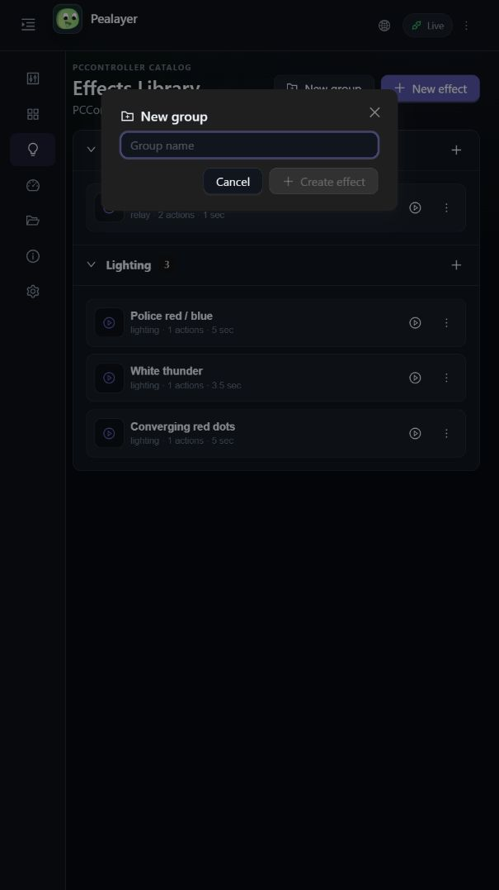
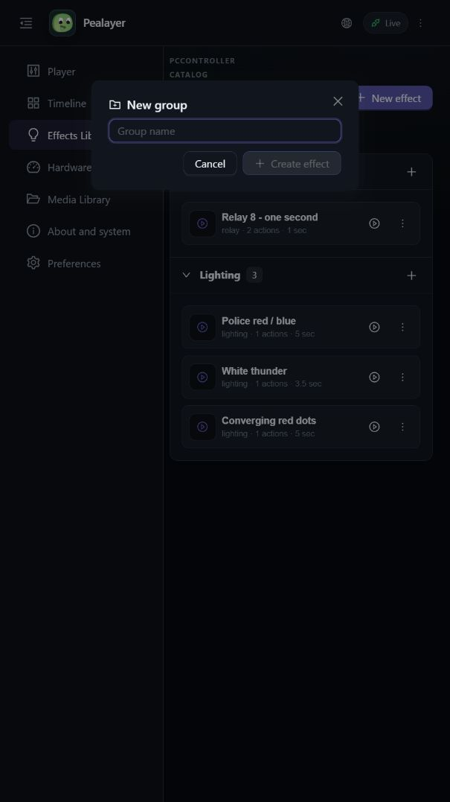
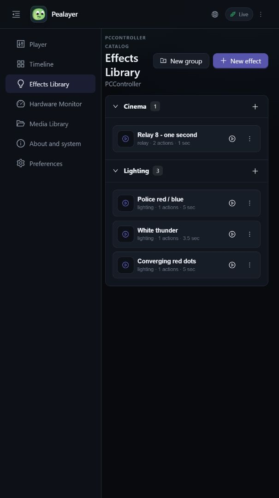
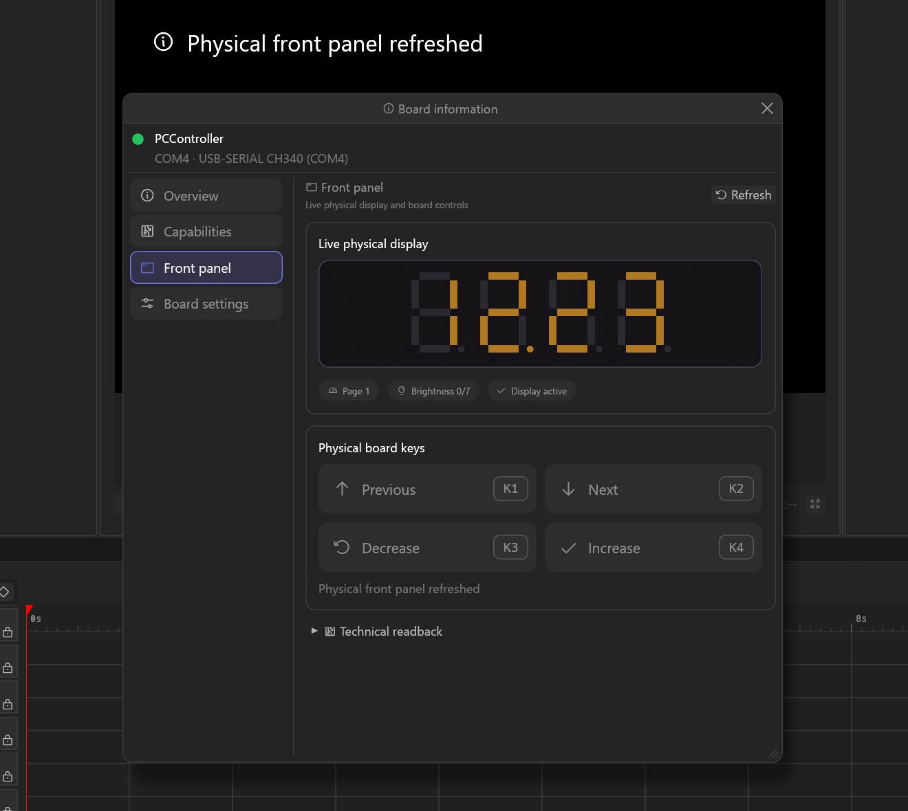

# Pealayer's interface evolution

These are genuine captures already preserved with the feature work. They show
intermediate development states, not proof that an older release contains a
later interface. They are not newly generated screenshots or final milestone
acceptance. The linked evidence describes the capture surface and limitations.

## Effects cards · quieter metadata

Before: combined metadata. After: neutral badges and a separate trailing duration.

[Capture and geometry evidence](../screenshots/effect-cards/README.md)

## Effect groups · integrated controls and palette

[Capture and interaction evidence](../screenshots/effects-library/README.md)

## Sequence capture · integrated authoring

[Recording workflow evidence](../verification/integrated-effect-capture.md)

## Front panel · actual board state

[Physical readback and key-action evidence](../screenshots/hardware-controls/front-panel/README.md)

## Next milestone captures

Capture the exact reviewed artifact, with non-private media/artwork and no
credentials on screen, following [the screenshot workflow](../SCREENSHOTS.md).
Include Preferences, Effect Controls, audio/SFX, source browsing and responsive
Web layouts. Do not reconstruct missing historical versions, reuse a stale
capture as current acceptance, or alter production state merely to stage data.
