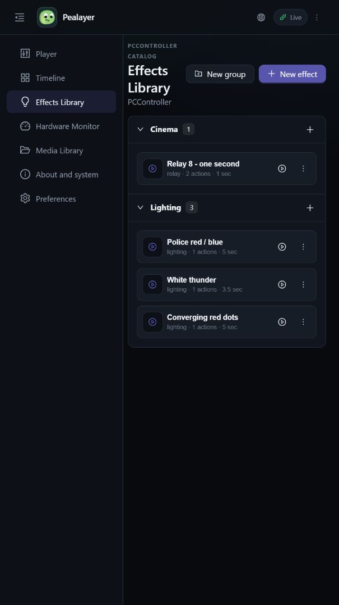
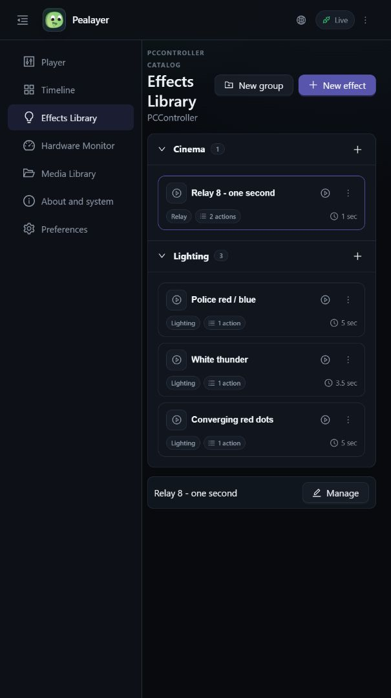
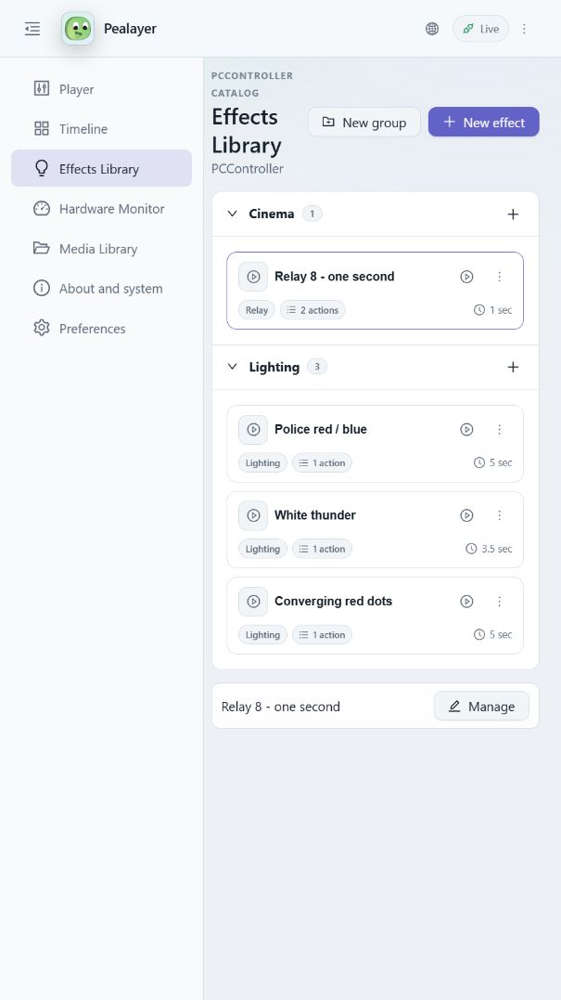

# Effects Library card refinement

Code build: `162f00648e52b893bbcf645bc2e2639dd1b34981`, draft PR #46.

The cards use neutral, outlined type/action-count badges instead of dot-separated metadata or accent-filled pills. Total duration is a separate right-aligned clock label; human-readable duration still comes from the existing controller catalog. Selected Web cards keep their neutral surface and use an accent outline only. Existing group quick-create, run, cue, action menus, inline rename, icon editing, and native drag handling are retained. No effect data or hardware output was changed during verification.

## Before and after

## Verification

- Actual running Web client checked with expanded/collapsed navigation: card widths 320.67 and 460.67 CSS px. All four catalog cards had the same width/height, no horizontal overflow, and duration positioned 12.67 px from the right edge (the card padding/border).
- Actual Web Actions > Manage opened the correct Relay 8 editor; canceled without saving. Clicking its caption focused the inline Name editor and preserved all card widths; Escape canceled the edit.
- Light surfaces: white cards, badges RGB(242,245,248), text RGB(94,106,120). Dark surfaces: cards RGB(17,22,30), badges RGB(23,29,39). Selecting a card did not change its background. Both use the selected shared palette, not fixed accent fills.
- Native metadata geometry/neutral-fill regression test passed in both themes at 220/340 px across repeated frames and long classification labels. Six existing native effect-card click/drag/drop/context-menu gesture checks and two group-header geometry/action checks passed. Native coverage is egui event/geometry tests, not native visual screenshot acceptance.
- TypeScript/Vite/PWA production build passed; Windows release packaging with `-SkipTests -NoUpx` and libmpv smoke validation passed. No full test suite run.
- Canonical local binary restarted through graceful `--quit` IPC, not a forced process kill. Running manifest reports the code build above, `git_dirty=false`, and SHA-256 `7c6dfc3174054833aea254489219d007ae1b2df6706d0d1f02dd2b31b9f71ffe`; `/healthz` reports `ok`, process PID 34876 at verification.
- Original System/Studio theme restored after light-mode checks. PR #46 remains draft and unmerged. A later documentation/images commit does not alter the executable code.
