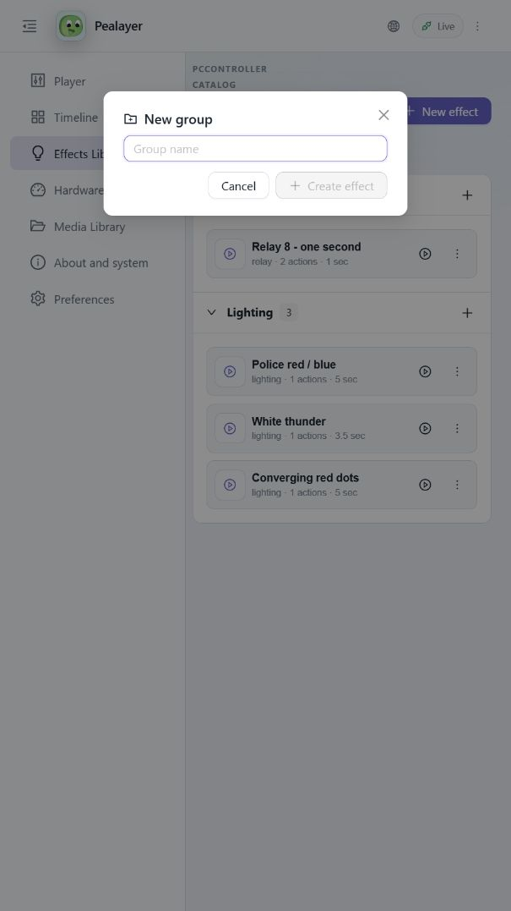

# Effect groups, shared palette, and Web header verification

Draft PR [#46](https://github.com/ToghrolTP/pealayer/pull/46), code build
`62aac623f27d69258e76231c39bd6ea513c0da80`.

## Using the changes

- Select the plus button at the end of an effect group header to create an effect in that group. The header's expand/collapse area is separate from this button.
- Select **New group**, enter a name, and select **Create effect**. Save the first effect to PCController to persist the group: groups are the catalog's categories, not a second local folder store. Canceling does not create or modify an effect.
- Choose **Preferences > Appearance > Interface > Color palette**: **Studio** preserves the previous Web palette, and **Neutral** offers the neutral alternative. Both palettes have light and dark variants and apply to Web and egui. Accent remains separately configurable.

The shared palette roles live in `assets/themes/palettes.json`. Web and egui consume the same values. Appearance is advertised through existing player status and WebSocket updates; the already-open Web client follows theme/palette changes without a reload.

## Before and after

Before: the modal used an unrelated gray background, and the navigation button's vertical center differed from the branding by about 6.7 px.

After: the dialog uses the selected surface/text/border roles in both themes.

The final group view includes quick-create buttons, the New group action, and centered menu/logo/title.

## Verification and boundaries

- Real Web clicks: Lighting quick-create preserves the expanded group and preselects Lighting in the new effect; a new group name is passed to its first effect editor. Both drafts were canceled without catalog changes.
- Real Web light/dark screenshots; header centers verified at narrow and desktop widths. The final narrow view measured centers at 30.666667 px for all three header elements (subpixel rounding only).
- Live appearance synchronization verified with API updates to light/Neutral, light/Studio, and restoration to System/Studio, without reloading the Web client.
- Focused Rust checks: two effect-group cases, two new-group cases, four palette/status cases, and five existing UI interaction/accent cases passed. Native group controls were exercised by egui pointer-event tests in both themes; no native visual screenshot acceptance is claimed here.
- TypeScript/Vite/PWA production build and Windows release packaging passed, including libmpv smoke validation. The full test suite was not run.
- DAVID-PC runs the canonical executable at `%LOCALAPPDATA%\Programs\Pealayer\bin\pealayer.exe`, PID 42652 at verification, with `git_dirty=false`; `/healthz` reports `ok`. Executable SHA-256: `d0cfe6e83a1f940128bd64cf758dccc76352dafa9766b0b2cb40ad2ae0b1249e`.
- Cafe-PC deployment remains unverified: its localhost SSH tunnel on port 7022 refused connection during this pass. No remote deployment is claimed.
- PR #46 remains draft and unmerged. The running build is the code commit above; this documentation/screenshots commit does not change executable code.
