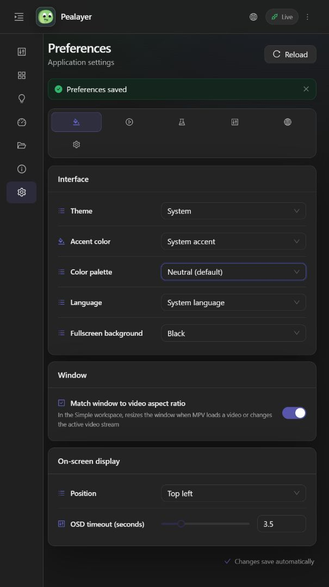
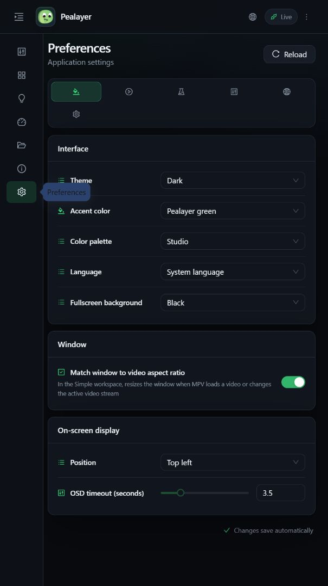
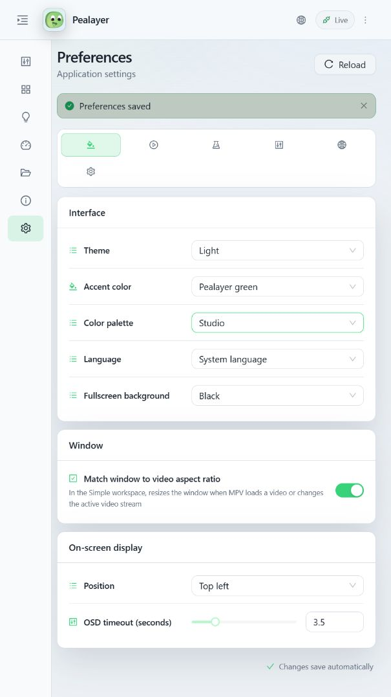

# Appearance palettes and live synchronization

Verified application code: `019d32828427ad2e02882e400b5e48e960856364`, on draft PR [#46](https://github.com/ToghrolTP/pealayer/pull/46). This evidence-only documentation does not change executable sources.

## Choose a palette

In desktop or Web **Preferences → Appearance → Interface → Color palette**, choose **Neutral (default)** for the original gray palette, or **Studio** for the newer blue-gray palette. Dark/light mode and accent are independent settings. Studio's shared JSON color definitions were preserved unchanged.

The local instance was left on Neutral, with its existing System theme and System accent. Changing factory defaults does not overwrite an explicitly saved Studio preference on another installation.

## Causes and corrections

- egui uses the active-widget foreground for ordinary bold captions. Pealayer green previously made that foreground nearly black on dark panels. Active controls now use an accent tint with palette-appropriate text; saturated selections and primary buttons retain contrasting selection text. Geometry and widget sizes were not changed.
- Runtime config snapshots previously started from disk, potentially reverting a live accent preview during an unrelated update. They now start from the authoritative live config.
- Appearance changes bypass the normal broadcast interval. Status advertises the host's resolved theme and accent, so a browser on a different OS does not independently choose a conflicting system theme.
- Open Web Preferences controls follow shared appearance changes. Native drafts reconcile external appearance without losing unrelated unsaved edits. Discard cannot undo a newer appearance committed by another client.
- Windows titlebar caption/text colors derive from the same palette roles, with proper RGB-to-COLORREF conversion. Changing palette repaints the titlebar even when dark/light mode is unchanged. Native decoration colors remain subject to the user's DWM theming preference.

## Verification

- Web build, type checking, and installable/offline PWA verification passed.
- Three focused Web appearance tests passed (defaults, shared preview merging, and host-resolved system theme/accent).
- Filtered Rust UI tests passed; additional focused tests cover palette persistence, bold-text contrast of at least 4.5:1 on ordinary/active surfaces in both palettes and both modes, readable green selections, dirty-draft reconciliation, and all four Windows titlebar palette/mode combinations.
- Packaged using the configured DAVID-PC libmpv profile with `-SkipTests -NoUpx`. Replaced only after graceful `--quit` IPC completion. Canonical process and `/healthz` were responsive; `/api/update/manifest` reported the exact code commit above and `git_dirty: false`.
- Sent a native `preview_config` command through `/api/ipc`: Web Preferences displayed dark Studio / Pealayer green. Disk retained the previous saved preferences during this preview.
- Sent `cancel_preview_config`: open Web controls returned to System theme/accent without a reload.
- Selected Neutral in Web Preferences: `/api/player/status`, `/api/config`, and the persisted JSON all reported `color_palette: native`.
- Previewed light Studio / green: the already-open Web Preferences controls and page changed without a reload. Host status and browser DOM agreed on light mode, accent `#38d27a`, surface `#f8fafc`, and text `#17202b`. Canceled this preview; final Neutral dark resolved colors are surface `#202020` and text `#eeeeee`.

Native screenshot verification remains blocked: Windows.Graphics.Capture failed twice with `IGraphicsCaptureItemInterop.CreateForMonitor ... 0x8007041D`. The screenshots above are real browser captures, not native egui proof. No physical hardware was actuated, no remote deployment is claimed, and PR #46 remains unmerged.
