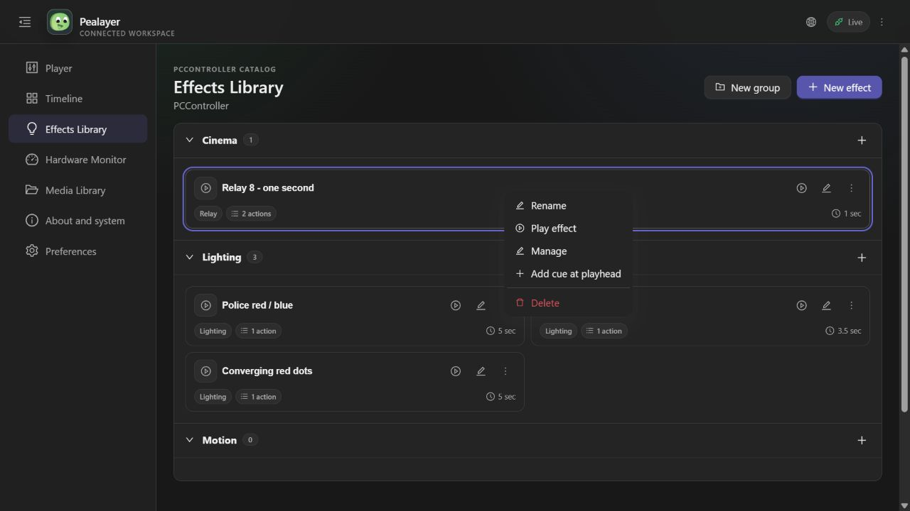
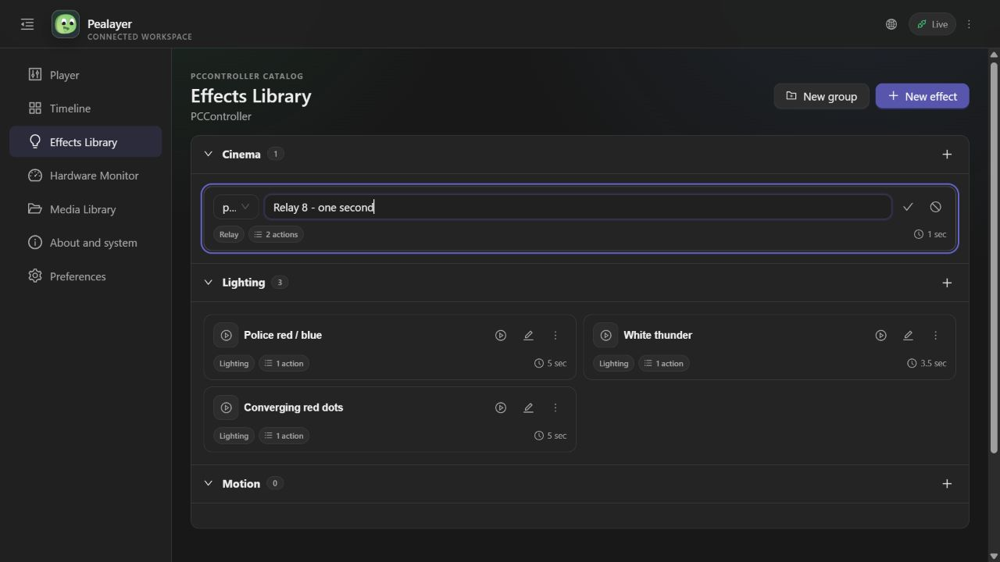

# Effect card Rename actions

## Use and implementation

- Effects Library cards now include a Phosphor pencil action labelled Rename and a dedicated Rename entry in the context menu/three-dot menu. These enter the same inline identity editor already used by the caption, not a second modal.
- Native context-menu requests are scoped to the effect card and consumed once on the next frame, so a popup action survives the panel's earlier persistence pass. The name input has a stable ID and receives focus once on entering rename mode. Enter/check saves; Escape/Cancel discards.
- Identity saves still select the current advertised sequence or strip definition and call `save_advertised_effect_identity` → `save_controller_effect`. PCController remains the catalog owner; effect ID, sequence steps/strip program and other properties are retained through the existing save path.
- The action row remains trailing-aligned. Four action slots now have an adaptive narrow-width budget, and the drag exclusion gutter covers the pencil too. The inline name budget no longer forces a 54 px minimum that widened very narrow cards. Existing drag payload/offset handling is unchanged.
- Web Effects Library uses the same existing inline name/icon state and `controller_effect.save` command. The pencil and both card right-click and three-dot menus expose Rename; normal card rows reserve three action columns, while editing rows retain the existing Save/Cancel layout.

## Verification

- `cargo test --lib --locked --jobs 1 effect_ -- --test-threads=1`: 31 passed, 0 failed. Includes real pointer press/release tests for all four native header actions (including the new pencil), no accidental drag payload, trailing alignment in light/dark and narrow/wide cards, stable card geometry, full drag regressions, scoped one-shot context rename requests and bounded inline input layout.
- TypeScript `tsc --noEmit` and Web production build passed; PWA `e19d72605f310121` verified 39 precached resources.
- No full test suite, hardware output activation or native visual acceptance is claimed. Live catalog names are not changed merely for verification.

## Deployment and live Web acceptance

- Optimized Windows package completed with `scripts/package-windows.ps1 -SkipTests -NoUpx`. The previous canonical process accepted the IPC quit command and exited before replacement.
- Canonical local executable is running as PID 31848 from `%LOCALAPPDATA%/Programs/Pealayer/bin/pealayer.exe`. `/healthz` reports `ok`; the update manifest reports source commit `d09cd3cbc54767521bdc327c089d2cceabd02c9e`, `git_dirty: false`, SHA-256 `78fb7c1cf42a3e9d894a1e9539770c21d2b202ecc099b88d6727381422a167c1`.
- In a temporary background browser tab, right-clicking the real Relay 8 effect showed Rename. Selecting it opened its existing inline name editor with keyboard focus. Clicking the pencil independently opened the same focused editor. Cancel restored each card without changing catalog names; all four real effects remain present. No Play/Run action was triggered. The user's original tab was left untouched.
- Cafe-PC's health endpoint was unreachable in this pass, so no remote deployment is claimed. PR #46 remains unmerged.

