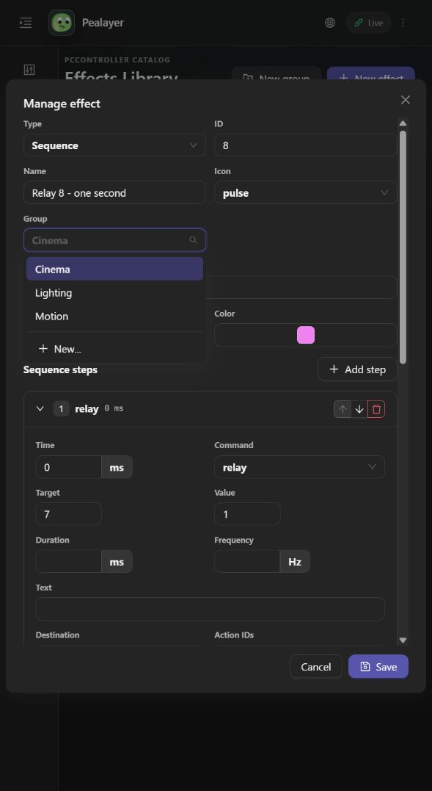
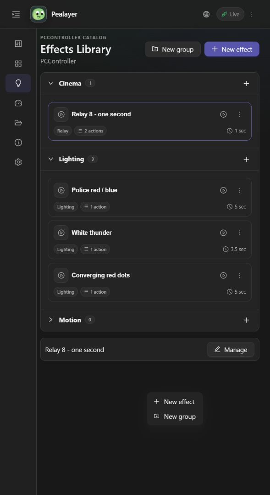

# Group selectors

Channel management and inline channel grouping use searchable single-value
comboboxes. Effects use a selection-only Group dropdown and explicit creation,
as described below. Neither presents a plain free-text assignment field.

## Channel grouping

1. Open Manage for a channel and expand the Group dropdown.
2. Choose an existing group, or type to filter the live choices.
3. To create a new group, type its name and choose **Create group**. In egui,
   Enter also accepts the name. Choose **Ungrouped** to clear the assignment.
4. Native channel dialogs retain **Save presentation**; inline channel edits retain
   their Save button. The Web channel dialog applies selections using
   `hardware.presentation.update`.

Channel choices come from PCController's current channel catalog, with the current
draft retained even if absent from the latest catalog. No sample group names or
second group store were introduced. Searching alone neither modifies a draft nor
sends an RPC. Group names retain case, Unicode and existing authoritative identity.

## Verification

- `cargo test --lib --locked --jobs 1 group_picker -- --test-threads=1`:
  options/normalization, bounds and draft preservation, plus real egui pointer
  selection/search/Enter creation/clearing in light and dark themes.
- Existing mutable-presentation contract test checks PCController catalog parsing.
- `npm run build`: TypeScript, production bundle and offline PWA integrity.

## Stateful effect Groups

Effect properties and recording use a selection-only **Group** dropdown. Its
**New...** button opens the shared group-creation dialog. The Effects Library's
empty-space context menu also offers **New group** and **New effect** in both
egui and Web. Empty groups are displayed and can be managed before any effects
are added. Creating a group saves a real PCController record instead of opening
a placeholder effect. Existing effect drafts are retained.

PCController publishes `effect_groups` in its snapshot and includes empty group
records in effects.json export/import. Pealayer relays creation through
`controller_effect.group.save`; the same current contract creates a group when
`original_name` is empty and updates its name and icon otherwise. No
Pealayer-owned group persistence is added.
The existing `category` storage key remains intact to preserve saved memberships;
user-facing labels consistently say **Group**.

Automated renderer/input checks are not physical-board or desktop screenshot proof.

## Live verification, 2026-10-05

- Canonical local Pealayer build `3d9851c` is running; PCController was updated
  through its own verified upload/restart operation, not a forced process kill.
- Right-clicking unused Web Effects Library space opened **New effect / New group**.
- Created the real empty **Motion** group using that dialog. PCController's
  persisted configuration and live snapshot contain it; Pealayer subsequently
  displayed it with zero effects. Existing four effects were unchanged.
- Manage → Group offered Cinema, Lighting, Motion and **New...**, with no arbitrary
  assignment option. New... opened the creation dialog without replacing the
  current effect draft. Both edit dialogs were closed without saving an effect.
- Windows native capture failed twice with `CreateForMonitor` error `0x8007041D`;
  native visual/pointer acceptance is not claimed. Native renderer interaction
  checks passed. CAFE-PC HTTP health probe timed out, so no remote deployment is
  claimed for this pass.

