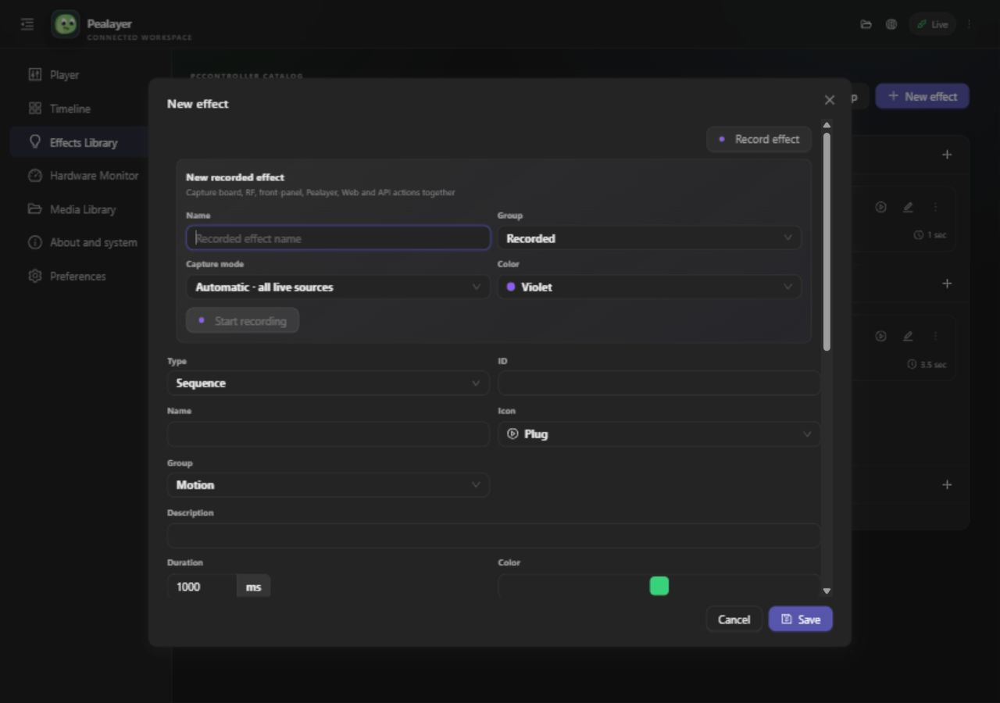
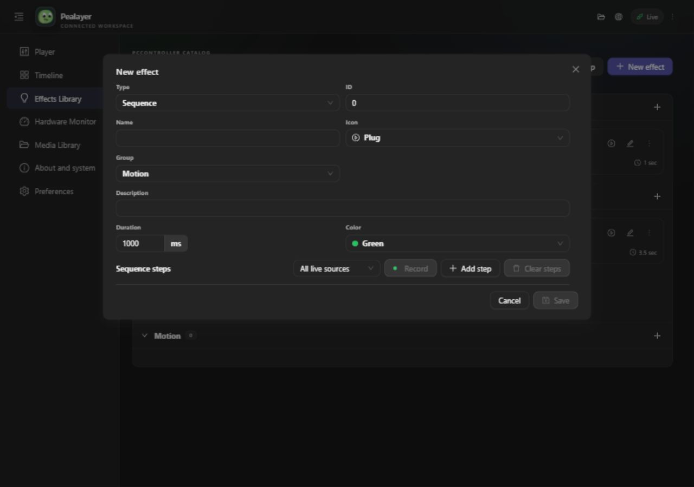
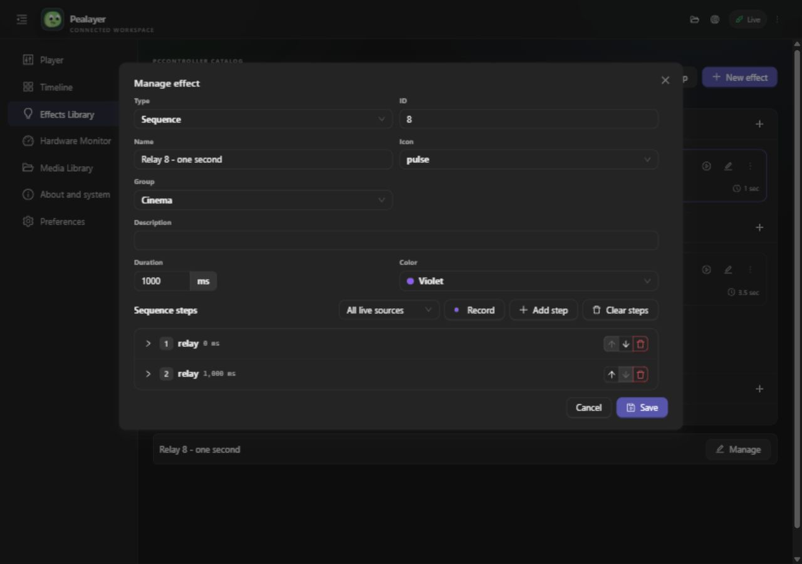
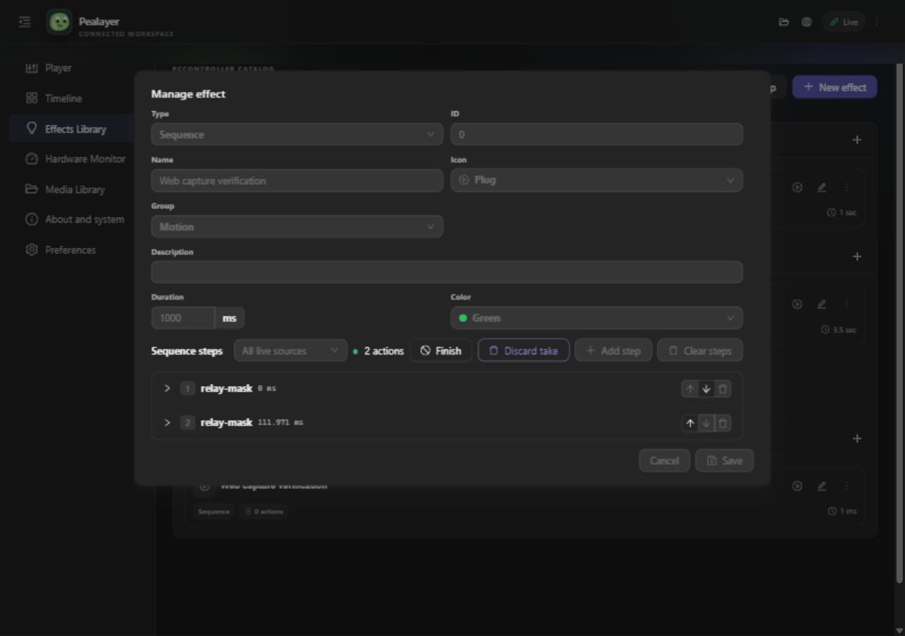

# Integrated sequence capture

The separate Record effect card/form has been removed. The native sequence
editor, Web Effects Library editor and Web timeline editor use the current
effect's metadata and put capture controls beside sequence editing actions.

1. Open a sequence through Effects Library → New effect or Manage.
2. Set its name, group, icon and color using the existing identity controls.
3. Choose a capture clock and press Record. Current edits are published before
   capture starts; PCController acknowledges publication before appending.
4. Use the live board/application controls. Actions appear in the same sequence.
5. Finish updates that effect. Discard take removes only the new capture.
6. To overwrite, delete the existing steps (Web: Clear steps), then Record.

PCController remains the catalog owner. Capture retains the same ID and
metadata, appends at the authored end (durations/repeats/fades included), and
does not change the playback policy or insert a new timeline cue. Existing
timeline templates refresh after the authoritative recorded catalog arrives.
Concurrent edits/deletions are rejected without losing the take.

Software checks are scoped to append, discard, cleared replacement, strict
clock wrap, full authored span, overflow, conflict retention and board-retained
download-prefix preservation. Native screenshot capture remains unavailable:
Windows Graphics Capture fails with capture-service timeout 0x8007041D. Native
visual acceptance must not be claimed from Web screenshots or compiler checks.

## Deployed verification, 6 October 2026

PCController commit `7eb4290e` was installed through its own host updater;
operation `op-0d881adb3160421b` acknowledged the restarted process and verified
SHA-256 `fda0edd73c60d378435066821d97d315b86cf3f9215b8efb0f14db3899a69c97`.
No firmware flash or physical-seat actuation was performed.

Pealayer `eed9317` was installed through `/api/update/from-url` using its own
graceful-quit/replacement/restart machinery. The restarted canonical executable
reported the expected commit and SHA-256
`c8fd918026ee1502c6188de627506660aa4cb7bff8c0921f8f4fd8c082b2b652`.
The previously paused media position remained 1256.089 seconds.

The live VirtualBoard acceptance script confirmed publication before capture,
unchanged effect identity/policy/metadata, a one-second authored append offset,
preserved prefix, discard, cleared-sequence replacement and no extra cue.
Its first cleanup exposed two issues: a null optional working draft was not
recognized by configuration patch validation, and direct owner deletion did
not immediately refresh the consumer's catalog. The draft field now remains
in the configuration contract even when null; the verifier routes deletion
through Pealayer so it requests the authoritative catalog refresh.

An additional real Web-button capture (Record → VirtualBoard R8 On/Off →
Finish) stored both applied edges in the same effect and returned them to the
editor. It also exposed an idle-interface race: a push requests a snapshot
and a repaint before the snapshot has finished, leaving the last capture edge
absent from the cached Web state until another UI interaction. The engine now
notifies interfaces after authoritative discovery completes. This is a
completion signal, not a permanent idle/GPU repaint timer.

The Web rate limiter could still suppress the completion repaint when it
arrived inside the configured sync interval. A deferred publication at that
deadline prevents the final idle state from remaining one event behind.

Final deployed Pealayer code is `91572707770fdd59a2c59a07416d50ca79e1c285`:

- Own updater operation: `update-54285818-7ef0-4df1-b430-080a66ff2fc9`.
- Canonical restarted process: `Programs/Pealayer/bin/pealayer.exe`, PID 22012.
- Manifest SHA-256: `da1c05caf86e50dc971e9d8eab588a86cd025af9f33faa81b20fa82e076ac52e`.
- Release build passed in 6m 07s; `cargo check --tests` passed in 17.84s
  (typechecking, not running the Rust test suite).
- `node docs/verification/verify-appended-recording.mjs` passed with exit 0,
  including temporary-effect removal and restoration of the working draft.
- A real Web Record-button test captured VirtualBoard R8 On/Off, 111.971ms
  apart. Both actions appeared while recording without subsequent clicks or
  pointer interaction; Finish returned both actions to the same editor.
- Temporary verification effects were removed. The original four catalog
  entries remain; recording is inactive, the working draft is null, no cue was
  added, and media remains paused at 1256.089s.

The build's dirty flag reflects local verification documentation/screenshots;
runtime source was frozen at the stated code commit. The subsequent evidence
commit does not change the deployed runtime source.

Before and after screenshots are real Web UI captures at 1280 × 900:

Café's HTTP updater manifest endpoint timed out; remote deployment has not
been verified. Both PRs remain draft/unmerged.
