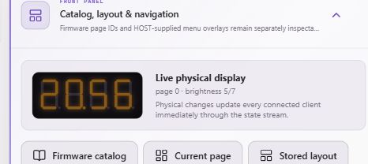

# Playback synchronization acceptance

Verified 2026-10-06 against the running canonical Windows applications, using
actual decoded libmpv playback and the updated **VirtualBoard**, not a physical
cinema controller. The private media filename and URL are intentionally omitted.

| Check | Observed result |
| --- | --- |
| Pause and seek to 65 seconds | Received 65000 ms; board ACK current sequence; cells `3f 86 3f 6d` (01:05) |
| Duration | Actual loaded-media duration 8553450 ms |
| Normal playback | Advanced 1440 ms during the 1400 ms check; program state Running |
| Pause | Advanced 0 ms during the 1200 ms check; program state Idle |
| Seek to 6000 seconds | Cells `3f 86 66 3f` (01:40 hours/minutes) |
| 2x playback | Advanced 2078 ms during the 1000 ms check |
| Playback event subscription | 31 `media.playback` state events; both playing and paused present |
| Client identity | One matching identity `pealayer:desktop-42144`, application/version/commit/OS/architecture and reverse-control actions retained |
| Restore | Original elapsed position, speed and paused state restored before check completion |

These are observations with polling and scheduling uncertainty, not a
frame-perfect or hard-real-time timing guarantee. Loopback board RTT rounded
to 0 ms; this is not an estimate for serial hardware or a remote network.

## Deployed binaries

Both replacements used the applications' own updater, not manual binary copying.

| Product | Source / replacement evidence |
| --- | --- |
| Pealayer | Commit `6a1a98ca4eb2cb868f9641459c47785de2b8374c`; running SHA-256 `9478b58a7e6c4bc529c2f57c3ca087b0236112f5bddbb039561ae4a9939118f0` |
| PCController | Host source fingerprint `f6fc4d63c74687c7c9a45f1f47ea4fbc1c18fe715fcbca1c2381184d03c4bd38`; replacement SHA-256 `a3ca9ee4b5394a2462c554f2c5f03af4c51f8a3841c29953680e9e631b8f7538`; updater operation `op-cfa87047799ff23c` acknowledged restart, `terminal_verified=true` |

Later verification/documentation commits do not change these deployed binaries.
Pealayer's libmpv DLL was preserved, not replaced by a different machine's DLL.

## Automated coverage

- Rust playback-sample and shared-identity unit tests passed.
- PCController focused media playback, program state, motion and IPC tests passed
  through the stable product-owned Windows Go runner.
- Native wire test verifies clock ACK, then lease expiration clears loaded state
  and releases the Running program claim.
- VirtualBoard media-clock and existing virtual-board tests passed.
- Full default AVR firmware build passed, without disabling existing features.
  Firmware source identity: `7B81735D`; estimated free SRAM 281 bytes.
  Application flash has **only 6 bytes spare**: future firmware changes must
  continue passing the enforced flash/stack checks.

Reproduce the live check with loaded media and no effect cues:

```powershell
node docs/verification/verify-playback-board.mjs http://127.0.0.1:8080 8787
```

The script refuses to perform playback gestures against a physical board and
restores playback state in `finally`. It requires an updated VirtualBoard to be
attached to PCController. Playback gestures do not directly actuate outputs,
but existing program-state consumers and cues still require care on real seats.

## Front-panel mirror



This screenshot shows the VirtualBoard mirror at the restored 20:56 position.
The Web UI renders the second cell's separator bit as a point; the physical
module determines whether that bit drives a colon or decimal point.

## Outstanding physical acceptance

No physical board was attached during this pass. Firmware was **built, not
flashed**. The local updated VirtualBoard remains attached on loopback port
8896 for inspection, using a separate copy of the existing EEPROM fixture.
The original fixture and its process were preserved. Café was unreachable
during the deployment checks and was not updated in this pass.

To complete physical acceptance, connect the board, deploy the matched firmware
through PCController's owned bridge, verify the firmware identity and repeat
play/pause/seek/speed/unload checks while observing the actual front panel.
Check `controller.media.playback.get`: `board_synced`, `board_sequence`,
`board_synced_at` and `board_error` distinguish an ACK from mere host connectivity.

Tracking: [Pealayer #46](https://github.com/ToghrolTP/pealayer/pull/46) and
[PCController #588](https://github.com/atomicdeploy/PCController/pull/588).
