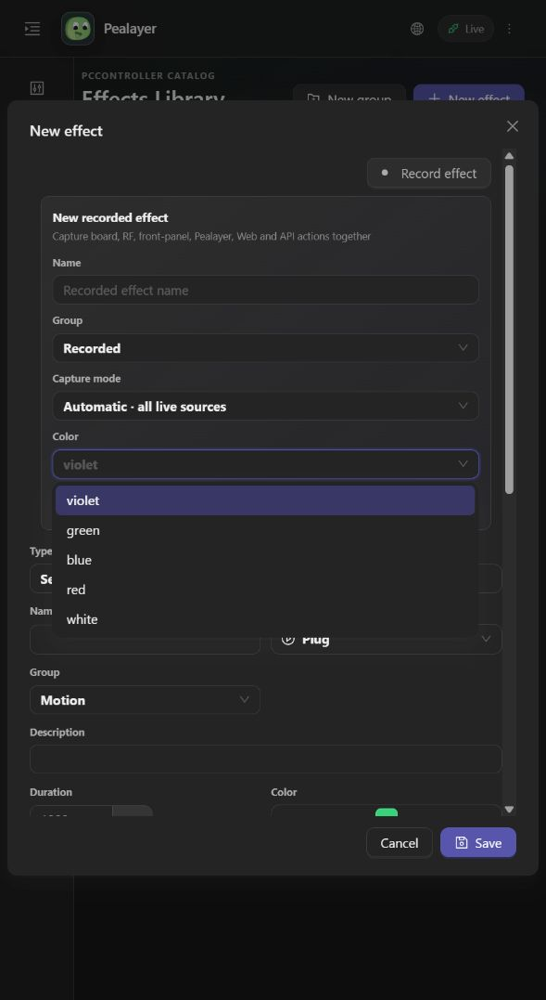

# Recording color feedback

The Record effect card previously rendered a text-only color selector. Desktop header color came from the theme/error palette, and Web record dots inherited button text color, so neither represented the user's selection.

Both interfaces now read `assets/themes/recording-colors.json`. Every dropdown option and its collapsed selection displays a circular color swatch. White swatches have an outline for light surfaces. The desktop header paints after selector input is processed, so clicking an option changes its record icon in that same frame. Web React state updates the record dots immediately. Once a recording is active, its advertised PCController color takes precedence over the local draft.

Recording commands, color IDs, catalog ownership and capture behavior are unchanged. No recording or hardware output needs to be started to verify this presentation fix.

Focused checks: `cargo test --lib --locked --jobs 1 ui::effects_library::tests -- --test-threads=1` (13 checks), including real dropdown pointer selection and same-frame header color, all five swatches, outlined light/dark rendering, and the real card header using draft color instead of theme accent. Web acceptance additionally requires `npm run build` and a live dropdown/icon check.

Before: 
