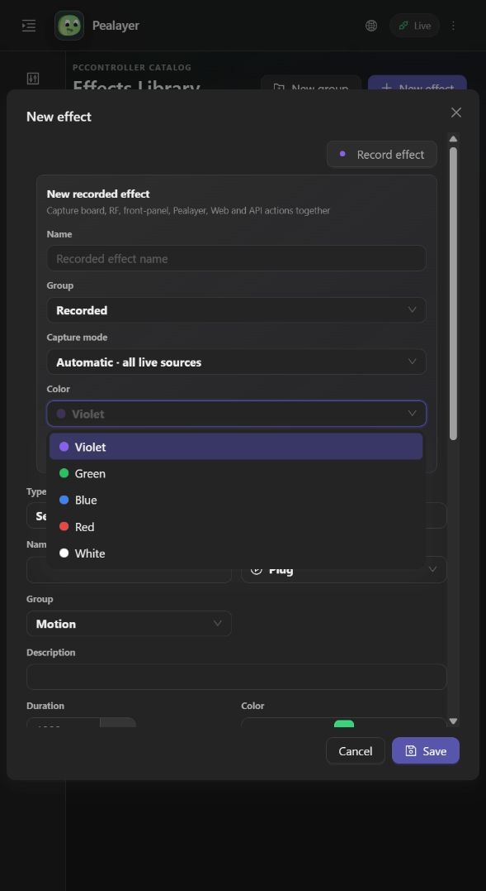
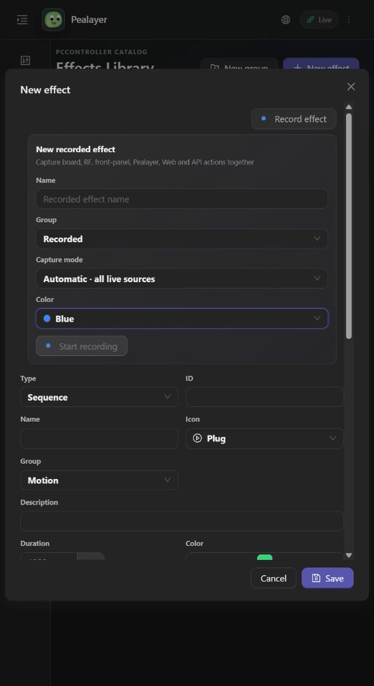

# Recording color feedback

The Record effect card previously rendered a text-only color selector. Desktop header color came from the theme/error palette, and Web record dots inherited button text color, so neither represented the user's selection.

Both interfaces now read `assets/themes/recording-colors.json`. Every dropdown option and its collapsed selection displays a circular color swatch. White swatches have an outline for light surfaces. The desktop header paints after selector input is processed, so clicking an option changes its record icon in that same frame. Web React state updates the record dots immediately. Once a recording is active, its advertised PCController color takes precedence over the local draft.

Recording commands, color IDs, catalog ownership and capture behavior are unchanged. No recording or hardware output needs to be started to verify this presentation fix.

Focused checks: `cargo test --lib --locked --jobs 1 ui::effects_library::tests -- --test-threads=1` (13 checks), including real dropdown pointer selection and same-frame header color, all five swatches, outlined light/dark rendering, and the real card header using draft color instead of theme accent. Web acceptance additionally requires `npm run build` and a live dropdown/icon check.

Before: 

After: 

Selected Blue: 

## Deployment and acceptance

- All 13 focused effects-library checks passed; TypeScript/Vite and PWA validation passed. Canonical packaging used `scripts/package-windows.ps1 -SkipTests -NoUpx`, not the full test suite.
- The previous application accepted the IPC quit command and exited before replacement. Canonical Pealayer relaunched as PID `34856`; `/healthz` returned `ok`.
- `/api/update/manifest` reported clean code commit `8dc9a02e05b1d8c94c3f8a228af25a139f2632f4` and executable SHA-256 `b890d25613cd81e6bd425ec264d74f0335888c53485e068670fcfa0d4cea67f9`.
- The actual deployed Web UI was reloaded. Its dropdown displayed Violet, Green, Blue, Red and White with swatches. Selecting Blue changed both visible record dots immediately to computed `rgb(59, 130, 246)`. Screenshots above are live browser captures, not mockups. No capture or output action was started.
- Native visual capture remained blocked by Windows Graphics Capture `0x8007041D`; desktop pointer/color checks are automated egui evidence, not a native screenshot acceptance claim.
- Cafe-PC's peer receiver health endpoint timed out. No remote deployment is claimed. Code and evidence stay on draft PR #46, unmerged.
