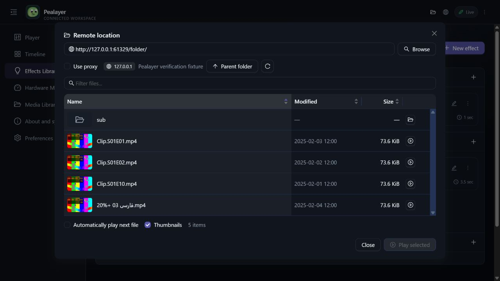
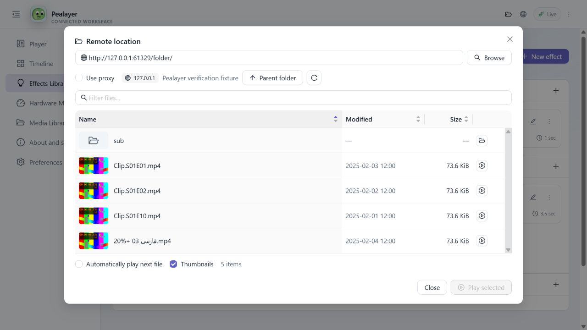

# Remote folder delivery verification

Verified on David-PC on 2026-10-06. Installed package: `0ba6b010c3ee85efd85ca0b556e5d44e8239dfd0`, clean source. The canonical Windows package passed resource validation and its host-specific libmpv smoke check; the production Web UI was packaged alongside it. No PR was merged.

## Results

| Surface or scenario | Evidence | Result |
| --- | --- | --- |
| Rust contracts and directory parsing | `cargo test --lib remote_ --jobs 1` | 17 passed; full suite not run |
| Production Web bundle | TypeScript, Vite, timeline-wheel checks, 7 messaging checks and 37-resource PWA verification | Passed |
| User-supplied directory tests, proxy off | Tests 1 / 2 / 3 discovered 32 / 12 / 12 playable files with size/date metadata | Passed |
| Query/path equivalence | Tests 2 and 3 yielded identical ordered filenames | Passed |
| Private host thumbnail | Real JPEG decoded from a listed file, proxy off; 6,807 bytes | Passed |
| Local HTTP fixture | Table metadata, Unicode and literal-percent URL handling, episode/date sorting, parent navigation, rejection of ordinary HTML, real JPEG thumbnails | Passed |
| Playback integration | Actual MPV playback, manual Next/Previous, optional EOF auto-next | Passed |
| CLI/native IPC | Canonical executable `--browse` with `--no-proxy` forwarded to the running instance | Passed |
| JSON/HTTP and JSON-RPC | Shared browse/select/sort commands and state endpoint | Passed |
| WebSocket | Sort command acknowledgement plus matching live shared-state update | Passed |
| Web interactions | Selection/details, filtering, sorting, subfolder/parent navigation, file context menu and shared auto-next preference | Passed |
| Web dark/light themes | Four real decoded 640×360 thumbnails; readable filename/date/size controls | Passed |
| Responsive dialog | 1280×720 and 640×800; selected-file details scroll within the modal, footer remains in bounds, no page-width overflow | Passed |
| Native visual verification | Windows capture failed with `0x8007041D` | Blocked; no native screenshot or visual pass claimed |
| Cafe deployment | Peer updater health endpoint timed out | Blocked; no manual SSH replacement attempted |

The playback test exposed MPV retaining the previous pause flag when loading a selected file. Remote Play/Next now explicitly starts playback; saved startup pause state is still restored separately. Narrow-screen checks also exposed a bottom-edge positioning issue, fixed by centering the bounded Web modal. Screenshot inspection caught faint light-theme metadata; the remote dialog now uses the shared palette's muted color instead of Ant Design's faint default.

The final live run restored the prior paused movie and playback position, recent-media records, playback-history configuration, System theme and the default-off automatic-next preference. Temporary test URLs are runtime arguments only. User-supplied hostnames, paths and media names are excluded from repository fixtures, this report and screenshots. Screenshots below deliberately use a local disposable media fixture, not a built-in product catalog.

## Screenshots

### Dark

### Light

## Use and repeat verification

See [Remote locations and folders](../remote-folders.md) for the user guide and the shared CLI/IPC/HTTP/JSON-RPC/WebSocket contract. Start with **File → Browse remote folder…** in the desktop app or the folder button in the Web header. A file URL can be inspected in the same browser, or opened directly for immediate playback with background sibling discovery.

Run `node scripts/verify-remote-folders.mjs` against a running local instance. Optionally set `PEALAYER_TEST_EXE` to test native single-instance IPC, and pass private HTTP(S) URLs as arguments without adding them to source. `--hold` leaves the local fixture available for UI inspection; finish using its printed local POST endpoint or terminal input. A timeout and cleanup restore playback/settings. Do not run playback verification while hardware cues are armed: this pass first verified that no timeline cues were present and did not test or actuate seat controls.

JavaScript-only indexes and authentication flows remain outside the supported HTML-autoindex contract. Unsupported thumbnails and unavailable sibling listings report errors without preventing ordinary file playback. Native visual verification and Cafe deployment are the remaining acceptance gates, not completed claims.
