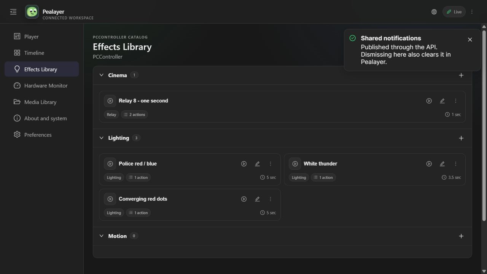
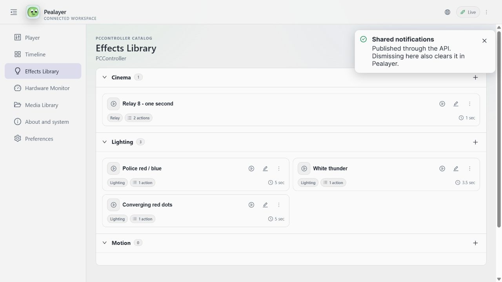

# Shared toast messaging — verified 2026-10-06

Implemented on PR #46 (not merged). Canonical local binary source: `f7c9f1a48f0fcabd8d055190eccd7d8af2f81f39`, clean Windows package, PID 42628 at verification. Graceful IPC quit was used before replacement. Health endpoint returned `ok` after launch.

## Delivered

- One bounded, transient host message service with typed severity/title/text/ID/expiry; native egui and Web/PWA overlays consume the same messages.
- Publishing and dismissal through native IPC, JSON commands, text CLI, HTTP API, JSON-RPC and WebSocket; live snapshots for terminal/TUI consumers, including contract discovery. No standalone TUI is claimed.
- Immediate state publication on message changes, ID upserts, shared dismissal, timed expiry, bounded/wrapped card text, theme-derived colors. No offline persistence or synthetic startup notices.
- Existing OSD/status behavior retained separately. Web control permissions are respected; direct WebSocket commands now validate before enqueueing.

Contract and runnable examples: [docs/messaging.md](../messaging.md).

## Verification

| Check | Result |
|---|---|
| Rust hub lifecycle/bounds tests | 2 passed |
| Text/JSON/RPC command parity and validation | 1 passed |
| HTTP permissions including message routes | 1 passed |
| Web lifecycle/reconnect/visible-count checks | 7 passed |
| TypeScript, production build and installable/offline PWA verification | Passed |
| `node scripts/verify-messaging.mjs` against running binary | Passed: IPC publish/read, HTTP update without duplication, WS publish/state delivery, RPC dismissal, invalid HTTP/WS rejection, expiry |
| Direct Windows named-pipe query (no HTTP fallback) | Read the shared message revision and toast set successfully |
| Browser: API-origin toast, dark and light | Visibly rendered; screenshots below |
| Browser close button → host and IPC | Empty active set, revision 16, confirmed in both HTTP and direct named-pipe response |
| Theme cleanup | Restored original `system` setting |
| Native screenshot | Blocked: Windows Graphics Capture `CreateForMonitor` service timeout `0x8007041D`; fresh binding retry failed too. Native code compiled; native appearance and close-button clicking are not visually verified |
| Cafe-PC | `http://cafe-pc:8080/healthz` timed out; no remote update claimed |

No hardware outputs were operated. Verification messages were dismissed/expired, leaving the active set empty. Full Rust test suite was not run.

## Web visual evidence

Dark:

Light:

## Remaining acceptance

- Native-window visual/click proof when the Windows capture service works (or user inspection).
- Cafe-PC peer update and remote acceptance when reachable; no manual SSH deployment fallback used.
- A future TUI may render this existing snapshot/command contract; a new terminal UI is separate work.
