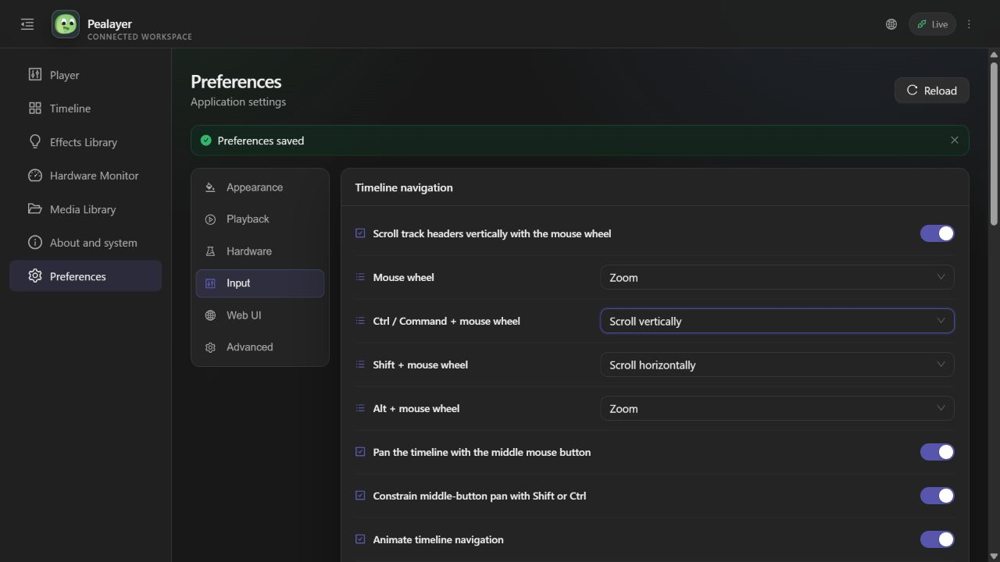
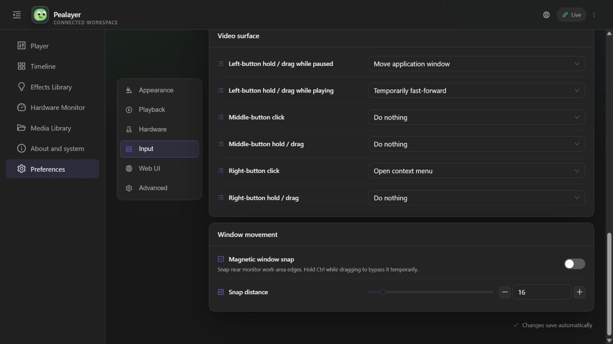

# Timeline wheel routing and configurable modifier actions

## Delivered

- Physical horizontal wheel input always pans X, including with Ctrl/Command, Shift, or Alt held. It is never used as a zoom delta.
- Native routing covers the track-header column, ruler, tracks/cues, and unused canvas space below the content. Both columns continue sharing the same vertical offset. Popup/modal layers are excluded from underlying wheel handling.
- Vertical wheel actions now use exclusive dropdowns in the shared Preferences contract, rendered by both egui and Web Preferences. Each offers Zoom, Scroll vertically, Scroll horizontally, or No action.
- Defaults: plain canvas wheel = Zoom; Ctrl/Command = Scroll vertically; Shift = Scroll horizontally; Alt = Zoom. Plain wheel over track headers retains the existing independently configurable vertical-scroll preference.
- Config keys: `timeline_plain_wheel_action`, `timeline_ctrl_wheel_action`, `timeline_shift_wheel_action`, and `timeline_alt_wheel_action`. Values use `zoom`, `vertical_scroll`, `horizontal_scroll`, or `none`. These replace the overlapping wheel-policy checkboxes; configurations without these keys receive the defaults above. Combined modifier priority is Shift, then Ctrl/Command, then Alt.
- Native processing reads original Point/Line/Page wheel events: egui otherwise converts Ctrl into zoom input and Shift into horizontal input before routing. Handled input is consumed once, including No action, preventing a second ScrollArea operation.
- The Web timeline has real horizontal extent when zoomed, cursor-anchored zoom, a sticky ruler, and wheel handling on its entire viewport rather than individual cue children.
- Player status and the existing WebSocket/HTTP state stream advertise `timeline_wheel_preferences`. Open Web Preferences and the timeline receive native/API changes without reload; Web edits use the existing config API and update the native app. No separate browser preference store was introduced for these policies.

## Verification

- 15 focused native timeline tests passed, including the new real egui input regression over empty space, Ctrl wheel consumption, horizontal-axis priority for every policy, original event units, pointer-anchored zoom, fixed ruler, and existing track geometry/hit testing.
- Shared Preferences test passed: defaults, modifier swaps, persistence roundtrip, valid/invalid API shape, all four dropdown definitions, and status serialization/deserialization.
- `npm run build` passed TypeScript, wheel-routing checks, production bundle generation, and PWA verification. Wheel checks now run on every Web build.
- Live browser test on the actual instance, with its actual empty cue timeline: plain wheel over unused space increased content width to 205.443%, retaining the cursor anchor. Horizontal wheel over the body moved X from 332.667 to 472.667; horizontal wheel over the ruler moved it to 552.667, leaving zoom unchanged. Ctrl vertical wheel left zoom and browser scale unchanged. This empty timeline has no vertical overflow, so no claim of visible Web vertical travel is made.
- Live config API swapped plain to vertical scroll, Ctrl to zoom, and Alt to horizontal scroll. The already-open Web Preferences dropdowns changed without navigation/reload. Selecting Ctrl = Scroll vertically in the browser then appeared in the native status API. All four requested defaults were restored afterward.
- Windows computer-use screenshot capture failed twice, including a fresh rebuilt-window binding: `IGraphicsCaptureItemInterop.CreateForMonitor`, error `0x8007041D` (capture service timeout). No blind native UI input or native screenshot claim was made. Native visual/manual wheel verification remains pending; native rendering/input tests passed.

## Deployment and preservation

- Implementation: `9bd91ed`; live synchronization: `1f91b9acb6112177d064a3fb67fb3d53a854a163`.
- Another agent's `ee9db98` Effects Library Run Now RPC fix was discovered on the remote branch and preserved by a non-rewriting merge (`846101c`), with no conflicts.
- Graceful `POST /api/ipc` quit preceded replacement. Built with `scripts/package-windows.ps1 -SkipTests -NoUpx` and launched the canonical binary, not a temporary work-directory executable.
- Running source commit: `1f91b9acb6112177d064a3fb67fb3d53a854a163`; manifest `git_dirty: false`; SHA256 `e05da1e3bf0dd7ffa2c1bb98746c805a13b7061e6f871abe60151f9858db354c`; size 36,376,576 bytes.
- Canonical executable: `%LOCALAPPDATA%\Programs\Pealayer\bin\pealayer.exe`; observed PID 44808; `/healthz` returned `ok`.
- Cafe-PC's `http://cafe-pc:8080/healthz` timed out. No manual SSH deployment was substituted, and remote delivery is not claimed.
- Code, generated Web assets, and this evidence are preserved on PR #46. The PR remains open/unmerged.

## Use

Open **Preferences → Input → Timeline navigation**. Choose each vertical-wheel action independently; to swap defaults, set Mouse wheel to Scroll vertically and Ctrl/Command + mouse wheel to Zoom. Horizontal wheel input still pans X. Settings apply immediately and persist.

